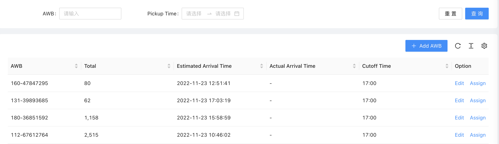

- ## 目标
- 1.  默认显示所有的awb下的order的事件整体信息.
  2.  可以查询单个或者几个awb的order事件整体信息.
  3.  可以对于单个awb的order进行重新推送.
  4.  可以输出按照awb划分的异常订单信息的Excel报表.
- ## 原型
- 
- 1. 查询条件如上图。
- 2. 数据列的信息包含以下字段：
  awbName  TotalOrder  ScanIn  ScanCompleted  PickupCompleted DeliveryCompleted  Exceptions  ScanInSend  ScanCompletedSend  PickupCompletedSend  DeliveryCompletedSend   ExceptionsSend
- 3. 可以导出页面的数据.(数据包含具体的订单状态)