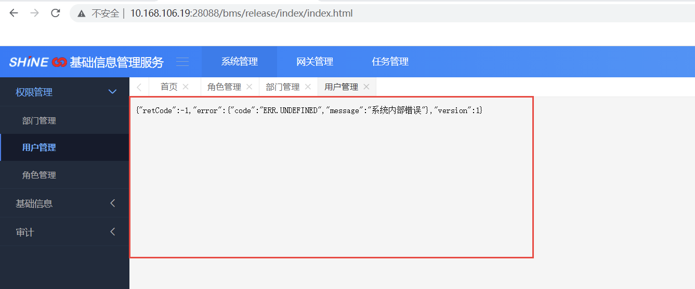
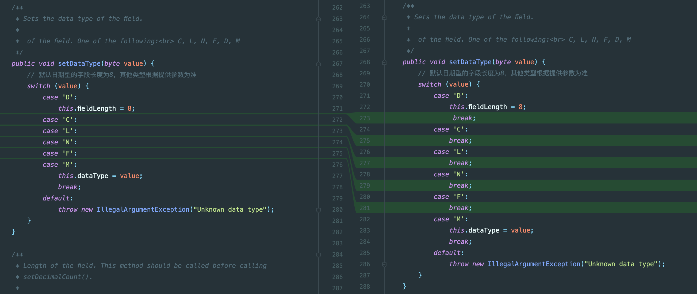

- ## 问题描述
- 结算产品部和BMS测试过程中出现：
- DBF导出时候报错出现以下错误
- 
- ```java 
  java.lang.RuntimeException: 为dbf文件添加行时出现异常！原因：Unknown field type 0
  	at com.shine.dfa.shine.component.autoExport.exporter.DataDbfExporterImpl.fillFieldMapRow(DataDbfExporterImpl.java:109)
  	at com.shine.dfa.shine.component.autoExport.exporter.DataDbfExporterImpl.appendDataSet(DataDbfExporterImpl.java:82)
  	at com.shine.bms.config.ExportInterceptor.appendAllDataSet(ExportInterceptor.java:102)
  	at com.shine.bms.config.ExportInterceptor.autoExport(ExportInterceptor.java:83)
  	at sun.reflect.GeneratedMethodAccessor673.invoke(Unknown Source)
  	at sun.reflect.DelegatingMethodAccessorImpl.invoke(DelegatingMethodAccessorImpl.java:43)
  	at java.lang.reflect.Method.invoke(Method.java:497)
  	at org.springframework.aop.aspectj.AbstractAspectJAdvice.invokeAdviceMethodWithGivenArgs(AbstractAspectJAdvice.java:644)
  	at org.springframework.aop.aspectj.AbstractAspectJAdvice.invokeAdviceMethod(AbstractAspectJAdvice.java:633)
  	at org.springframework.aop.aspectj.AspectJAroundAdvice.invoke(AspectJAroundAdvice.java:70)
  	at org.springframework.aop.framework.ReflectiveMethodInvocation.proceed(ReflectiveMethodInvocation.java:175)
  	at org.springframework.aop.interceptor.ExposeInvocationInterceptor.invoke(ExposeInvocationInterceptor.java:93)
  	at org.springframework.aop.framework.ReflectiveMethodInvocation.proceed(ReflectiveMethodInvocation.java:186)
  	at org.springframework.aop.framework.CglibAopProxy$DynamicAdvisedInterceptor.intercept(CglibAopProxy.java:691)
  	at com.shine.bms.system.controller.UserController$$EnhancerBySpringCGLIB$$624e1b7b.queryUsers(<generated>)
  	at sun.reflect.GeneratedMethodAccessor796.invoke(Unknown Source)
  	at sun.reflect.DelegatingMethodAccessorImpl.invoke(DelegatingMethodAccessorImpl.java:43)
  	at java.lang.reflect.Method.invoke(Method.java:497)
  	at org.springframework.web.method.support.InvocableHandlerMethod.doInvoke(InvocableHandlerMethod.java:190)
  	at org.springframework.web.method.support.InvocableHandlerMethod.invokeForRequest(InvocableHandlerMethod.java:138)
  	at org.springframework.web.servlet.mvc.method.annotation.ServletInvocableHandlerMethod.invokeAndHandle(ServletInvocableHandlerMethod.java:105)
  	at org.springframework.web.servlet.mvc.method.annotation.RequestMappingHandlerAdapter.invokeHandlerMethod(RequestMappingHandlerAdapter.java:892)
  	at org.springframework.web.servlet.mvc.method.annotation.RequestMappingHandlerAdapter.handleInternal(RequestMappingHandlerAdapter.java:797)
  ```
-
- ## 问题版本
- 通过场景复现发现问题DFA-Boot 1.0.0.4出现，DFA-Boot 1.0.0.3无此问题。
- ## 代码跟踪
- 通过代码排查和跟踪发现，此问题原因为：
- ```java 
  java.lang.RuntimeException: 为dbf文件添加行时出现异常！原因：Unknown field type 0
  ```
- 通过代码中此问题报错的地方跟踪可知，错误原因是设置dbf的datatype的时候给了个初始值为0，故导致此问题产生，经过svn日志排查可知，错误代码为2022年2月16号使用IDEA自动代码重构的时候下列代码进行了变化导致。
- 
- ## 问题总结
- 当类型为D/C/L/N/F/M(基本上为所有类型)的情况下导出均不可用，属于阻断流程问题。问题较严重，需要使用hotfix进行修复，故需要添加DFA-Boot hotfix 001 修复此功能。
- 修复的代码为：
- ```java
  public void setDataType(byte value) {
          // 默认日期型的字段长度为8，其他类型根据提供参数为准
          if(value == 'C' || value == 'L' || value == 'M' || value == 'N' ||  value == 'F' || value == 'D'){
              this.dataType = value;
              if(value == 'D'){
                  this.fieldLength = 8;
              }
          }else {
              throw new IllegalArgumentException("Unknown data type");
          }
      }
  ```
-
- ## 后续动作
- 1. 在DFA-Boot hotfix 001中修复此问题。
  2. review DFA-Boot 1.0.0.4 发布过程中的代码变化。若为重构代码需要进行排查是否产生逻辑变化的隐含bug。若有则需要修复。
-