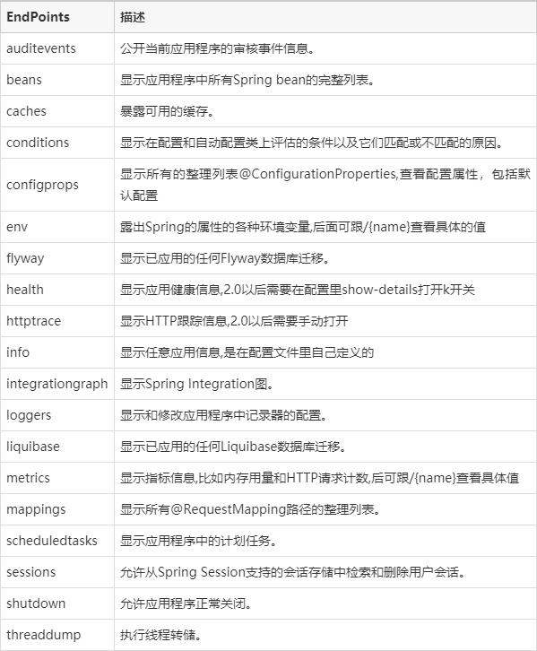

- ## 背景
- 参照SpringBoot Actuator 设计属于DFA体系自己的Actuator，提供对于服务的状态监控、服务的依赖监控、服务状态上报，通用服务信息织入接口等功能。
- ## Spring Boot Actuator
- Spring Boot Actuator是Springboot的四大核心之一，SpringBoot的四大核心如下：
- 1、Actuator：springboot程序监控器
  2、自动装配：简单配置甚至零配置即可运行项目
  3、starter：jar包的引入，解决jar版本冲突问题
  4、CLI：命令行
- 当程序引入依赖并且写好配置之后，启动项目即可看见actuator的对应的端点，SpringBoot Actuator包含的endpoint如下
- 
- 而默认只开启了info和health两个端点。
- ## DFA Boot Actuator
- DFA Boot Actuator参照Springboot Actuator的使用方式进行设计，并且进行部分的裁剪，目前只暴露四个endpoint：ping，info，health和metrics，并且提供info，health和metrics这三个endpoint的读写能力。
-
- ### 整体设计
- #### endpoint保护
- DFA Boot Actuator模块对所有的endpoint需要有自我保护的能力。包含以下功能：
- 1. 快照能力(返回上一次成功的数据)
  2. 流控能力(可以配置每个endpoint的rate limited)
- #### 信息写入
- DFA Boot Actuator模块需要提供入口给DFA-Boot的组件和业务系统进行info,health和metrics的信息的写入。
-
- #### info信息写入
- #### health 信息写入
- #### metrics 信息写入
- 一、提供端点
  1- ping 仅提供当前节点存活状态
  2- health 提供节点及各个组件存活状态，包括错误信息
  3- metrics 提供节点及各组件的metric信息，可通过参数获取指定组件信息
  4- info 提供节点及各组件的info信息，可通过参数获取指定组件信息
- 二、自我保护策略
  1- 端点频率保护（比如1分钟内仅返回上一分钟的信息）
  2- 错误保护（组件相关访问报错保护）
  3- 警告（比如组件接口访问时间过久等警告信息输出）
  4- 快照（保存上一次信息，用于超过阈值时返回）
  5- 提供个组件、端点的开关配置
- 三、其他
- 1、提供切面能力，在检查项开始前和结束后的切面
- 类似：可提供Event交由ApplicationListener处理，或则提供类Filter能力
- 2、提供排序能力，使用spring的order能力
-
-
-