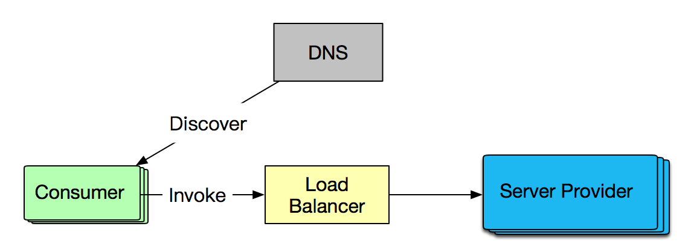
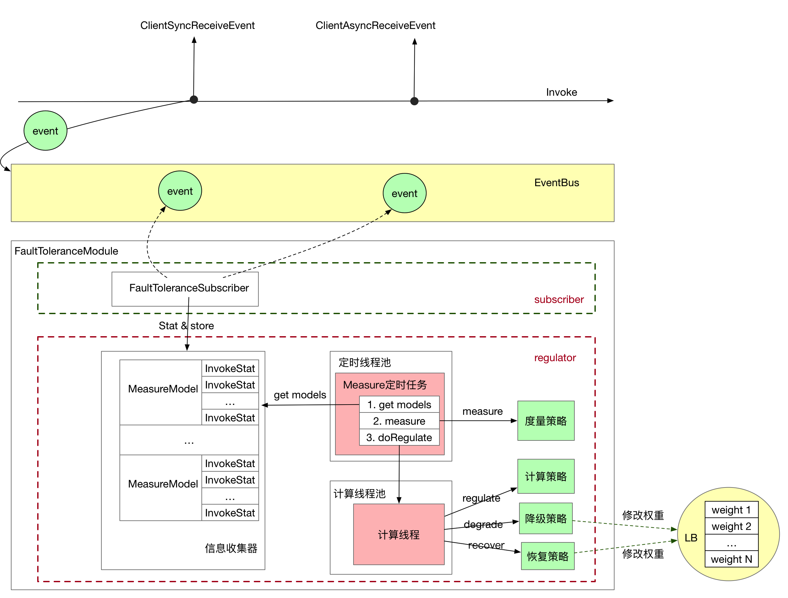
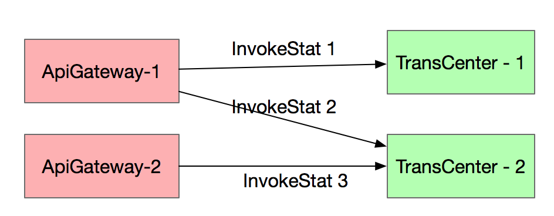
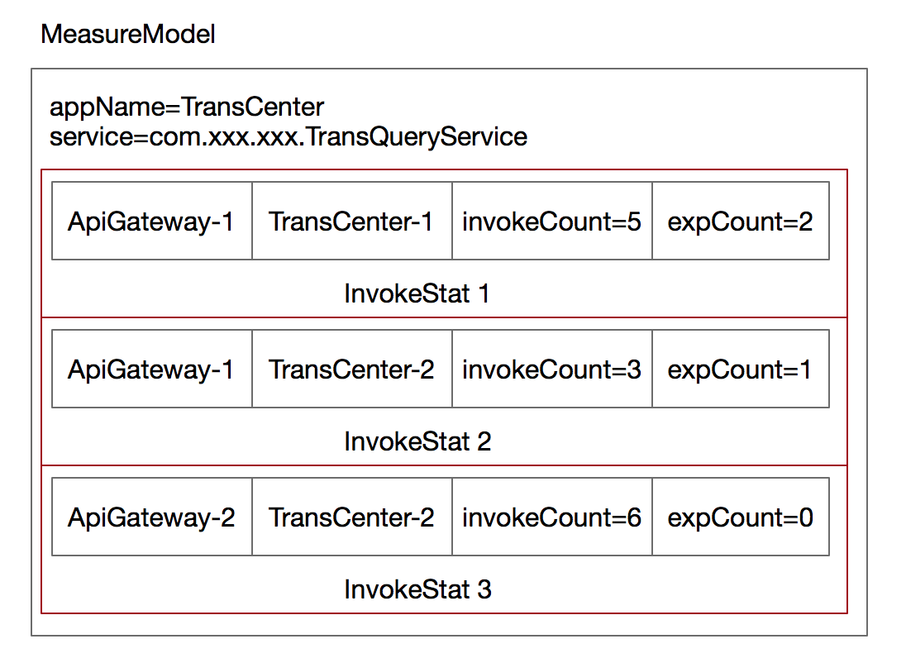
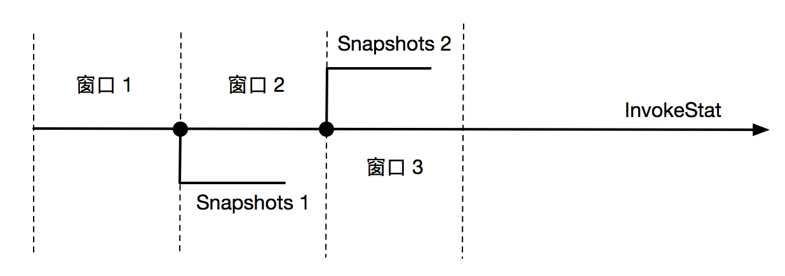
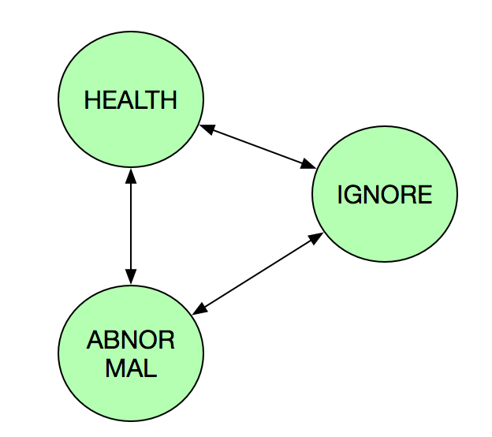

- ## 一. 前言
- 对于金融业务而言每个环节都涉及到大量的资金操作，若因为网络、硬件等原因导致系统不稳定性，不仅影响用户体验，更重要的是可能会引起资损问题，因此系统可用性至关重要。在微服务分布式架构中提高系统可用性的常见方案是 集群（冗余）。 集群方式将一个服务部署在多个机器上，通过硬负载或软负载实现服务的均衡负载，虽然可以有效避免单点问题，但是仍然避免不了某些场景单机故障引起服务调用失败的问题。
- DFA-RPC 提供了自动单机故障剔除能力，能够自动监控 RPC 调用的情况，对故障节点进行权重降级，并在节点恢复健康时进行权重恢复，提高系统可用性。本文将从以下几个方面进行剖析：
- 1. 单机故障和服务降级介绍
  2. DFA-RPC 单机故障剔除原理
## 二. 单机故障和服务降级
- 在分布式架构中常见高可用可用性方案的是 集群（冗余），即将一个服务部署在多个机器上，通过硬负载或软负载实现服务的均衡负载。硬件负载因每次请求都需要经过硬件负载，承担所有的访问压力，当集群规模增加、流量增多，硬件负载可能因无法支撑所有流量而导致系统不可用。
- 
- 软负载则提供注册中心，并将负载能力转移到服务调用方( Consumer )，注册中心只有在 Consumer 首次订阅或服务发生变化时才会发生交互，避免了并发访问下的单点问题。下图是基于软负载的服务调用：
- 
- 虽然软负载可以避免单点问题，但可能存在以下场景导致服务不可用：
- 1. Provider 出现单点故障或宕机，与 Consumer 的长连接已断开，但注册中心尚未摘除或未及时通知Consumer。
  2. Consumer 和 Provider的长连接还在，注册中心未下发摘除，但服务器端由于某些原因，例如长时间的 Full GC, 硬件故障（后文中为避免重复，统一描述为机器假死）等场景，处于假死状态。
- 这两种场景都是服务端出现故障，但由于长连接还保留等原因注册中心未摘除服务，导致服务调用失败。针对第一种情况 Consumer 不应调用出现故障的 Provider，否则会引起部分服务不可用；针对第二种情况，这个 Consumer 应该不调用或少调用该 Provider，可以通过权重的方式来进行控制。目前 DFA-RPC 以上的版本支持 RPC 单机故障剔除能力。DFA-RPC 通过服务权重控制方式来减少异常服务的调用，将更多流量打到正常服务机器上，提高服务可用性。
- ### 2.1 DFA-RPC故障剔除和注册中心故障剔除
- DFA-RPC 的故障剔除与注册中心故障服务剔除不同，它们从不同的维度来完成故障剔除提高服务可用性。主要两方面的区别：
- 1. 故障剔除的时机
  2. 故障剔除的细粒度
#### 故障剔除的时机
- DFA-RPC 的故障剔除与注册中心故障服务剔除不同，它们从不同的维度来完成故障剔除提高服务可用性。
- 注册中心服务管理关注 Provider 与注册中心的心跳或长连接。如果 Provider 出现心跳异常或长连接不存在，则及时将服务从注册中心剔除，并告知 Consumer 移除本地缓存的故障 Provider 信息。Comsumer 在负载均衡选择时则不考虑被剔除的 Provider，如图所示
- 
- 而 DFA-RPC 单机故障剔除针对的场景不同，针对的是注册中心还未剔除的服务，这些服务与 Consumer 仍然保持长连接，但由于机器假死，不能提供正常服务。 如下图所示：
- 
####  故障剔除的细粒度
- 注册中心剔除的是粒度是针对单机上的某个服务进程，属于进程级别。一旦这个进程和注册中心断开连接或心跳无感应，则将其从注册中心剔除。
- DFA-RPC 故障剔除并控制精度会更精细一些，会细致到进程对外暴露的服务，如部署在某个机器上的交易系统对外提供的交易查询服务 TransQueryService. 管理的维度是 IP + 服务， 这里的服务特指进程中的服务接口。
### 2.2 服务权重降级 vs 服务降级
- 服务降级是当服务器压力剧增的情况下，根据当前业务情况及流量对一些服务和页面有策略的降级，以此释放服务器资源以保证核心任务的正常运行。这里的降级级别是整个系统服务，而不是针对接口级别。
- DFA-RPC 的服务降级，是指当某些个别机器因为存在机器假死，导致处于假死状态，导致一些服务接口响应异常，通过 DFA-RPC 的故障剔除和服务权重降级来减少对这些异常机器接口的访问，而将更多的流量打到正常的机器上。 这里针对的维度主要还是 IP + 服务维度，如部署在 xxx 机器上交易系统对外提供的 TransQueryService 服务。
## 三. 原理解析
- 通常一个服务有多个服务提供者，其中部分提供者可能由于机器假死等导致长连接还存活但是程序已经无法正常响应 。 故障剔除功能会将这部分异常的服务提供者进行降级，使得客户端的请求更多地指向健康节点。当异常节点的表现正常后，故障剔除功能会对该节点进行恢复，使得客户端请求逐渐将流量分发到该节点。
- DFA-RPC支持故障剔除的功能，故障剔除功能采用自动化监控和降级，因此可以减少人工干预，提供系统可用率。DFA-RPC 剔除的维度是服务 + Ip 级别。为了支持单机故障剔除能力，DFA-RPC 提供了以下几个方面的设计：
- 1. **入口设计**: 进行RPC调用的时候，增加一个信息统计的传递入口。DFA-RPC 采用无缝插入设计，在不破坏开放封闭原则前提下引入单机故障剔除能力。
  2. **信息收集器** : 维护和管理从入口传进来的统计信息。
  3. **计算策略** :  主要是根据度量结果，判断是否需要执行降级或者恢复服务。如果命中降级规则，则触发降级行为。如果命中恢复规则，则触发恢复行为。
  4. **度量策略** : 负责按一定维度对调用信息做度量，判断服务正常或异常。
  5. **降级策略** : 如果服务异常，需要进行降级处理，降级策略指定了处理逻辑，比如按打印日志或降低服务权重。
  6. **恢复策略** ：当一个异常服务恢复正常时，如何恢复该服务，例如提高服务权重等。
### 3.1 整体结构和入口
- DFA-RPC 单机故障剔除模块是 FaultToleranceModule， 通过 DFA-RPC 的 SPI 机制完成模块的自动化加载，以完成该功能的插入。 FaultToleranceModule 模块包含了两个重要部分：
- 1. **subscriber 事件订阅器** ：通过订阅事件总线 EventBus 的事件，以零侵入方式完成 RPC 调用的统计和信息收集。
  2. **regulator 调节器** ：根据收集的 RPC 调用信息，完成服务调用或服务权重的调节，达到服务降级和服务恢复的目的。内置了信息收集器、计算策略、度量策略、恢复策略， 是单机故障剔除的核心实现。
  FaultToleranceModule 主要关心两种调用事件：
- 1. 同步结果事件： ClientSyncReceiveEvent， 收集和统计 RPC 同步 调用次数和出现异常的次数。
  2. 异步结果事件： ClientAsyncReceiveEvent，收集和统计 RPC 异步 调用次数和出现异常的次数。
- 虽然SOFAPRC 5.3.0 以上版本已经内置了 FaultToleranceModule， 但默认情况下单机故障剔除功能是关闭的，需要开启 regulationEffective 全局开关，才能开启整个单点故障自动剔除功能，否则完全不进入该功能。如图所示是整个 SOFARPC 故障自动剔除功能的整体结构：
- 
- 整体流程如下：
- 1. 在 RPC 同步或异步调用完成后会向事件总线 EventBus 发送对应事件。
  2. FaultToleranceModule 的订阅者收到对应事件，开始进行调用统计，将统计结果存储到 信息收集器中。并在第一次存储时触发 Measure 定时任务。
  3. Measure 定时任务会在指定窗口时间定时执行。获取信息收集器的所有信息并交给 度量策略 做度量计算，并开启计算线程负责进行计算和服务调节。
  4. 计算线程首先会 调用 计算策略，计算策略根据 度量策略的计算结果判断是否执行降级或恢复
  5. 如果进行降级，则调用降级策略执行降级操作，如打印日志或降低故障服务权重。
  6. 如果进行恢复，则调用恢复策略执行恢复操作，如打印日志或恢复故障服务权重。
  7. 最后在 RPC 调用的时候，负载均衡器(默认是 random + weight 负载均衡)会根据根据权重来选择服务。权重越低的服务被调用概率越小，流量流入更少；权重越大的服务，被调用概率越大，流量流入增多。
### 3.2 信息收集器
- 信息收集器负责是 RPC 调用的信息收集和存储工作，了解信息收集器的存储结构有利于了解故障剔除的维度和 RPC调用统计管理。
#### 数据结构
- TimeWindowRegulator 中维护了一个 MeasureModel 的列表结构，采用 CopyOnWriteArrayList 数据结构，保证线程安全。
- > private final CopyOnWriteArrayList<MeasureModel> measureModels
- MeasureModel 是按 app + service 的维度存储，即一个应用下的某个服务，如交易系统中的交易查询服务 TransQueryService. 正常一个服务会部署在多个机器上，MeasureModel 会维护这些所有服务, 在数据结构内部使用 InvocationStat 列表来维护这些机器上的服务调用关系。
- ```java 
  private final String                            appName;
  private final String                            service;
  /**
   * all dimension statics stats of measure model
   */
  private final ConcurrentHashSet<InvocationStat> stats;
  ```
- 假设有两个服务 ApiGateWay 和 TransCenter，分别都部署在两台机器上。 TransCenter 向 ApiGateWay 提供了交易查询（TransQueryService）服务 , 如图所示：
- 
- 如上图所示 InvokeStat 是基于 consumer + provider + service 维度，InvokeStat1 表示 ApiGateway1 调用了 TransCenter-1 的 TransQueryService 服务。 因此 TransCenter 的MeasureModel 数据模型结构如下：
- 
#### 窗口计算
- 为了保证并发调用环境下的数据安全性，InvokeStat 中的数据采用原子类作为变量类型。事件订阅器收到同步或异步结果事件后，就会从工厂中获取这次调用的 InvokeStat（如果 InvokeStat 已经存在则直接返回，如果没有则创建新的并保持到缓存中）。通过调用 InvokeStat 的 invoke 和 catchException 方法统计调用次数和异常次数。
- 在每个窗口到期时，则会从 MeasueModel 的各个 InvokeStat 创建一份镜像数据，表示当前串口内的调用情况。而原 InvokeStat 进入到下一个窗口，进行统计，由于此刻为扣除上一个窗口的统计信息因此该窗口的数据包含了上一个窗口的统计数据。当度量策略将本窗口的镜像数据统计完成以后，会将 InvokeStat 的数据扣除掉当前窗口的镜像数据，使得 InvokeStat 中的数据为下一个窗口调用数据。
- 
### 3.3 度量策略
- 度量策略会计算模型 MeasureModel 里的数据进行度量，选出正常和异常节点。 默认采用服务水平 ip 资源度量策略，如果某个 ip 的异常率大于该服务所有 ip 的平均异常率到一定比例，则判定为异常。
- 度量策略将计算模型设置为三种状态：HEALTH(正常)、ABNORMAL(异常)、IGNORE(忽略)。这三种状态根据异常率情况相互转化。
- 
- 继续以 TransQueryService 为例，阐述度量策略的操作过程：
- 
- 结合上述例子，度量策略的大致逻辑如下：
- * 首先统计该服务下所有 ip 的平均异常率，并用 averageExceptionRate 表示。平均异常率比较好理解，即异常总数 / 总调用次数，上例中 averageExceptionRate =(1 + 4) / (5 + 10 + 10) = 0.2.
  * 当某个 ip 的窗口调用次数小于该服务的最小窗口调用次数( leastWindCount )则忽略并将状态设置为 IGNOGRE。否则进行降级和恢复度量。 如 invokeStat 1 的 invokeCount 为5，如果 leastWindCount 设置为6 则 invokeStat 1 会被忽略。
  * 当某个 ip 的时间窗口内的异常率和服务平均异常比例 windowExceptionRate 大于 配置的 leastWindowExceptionRateMultiplte (最小时间窗口内异常率和服务平均异常率的降级比值)，那么将该IP设置为 ABNORMAL, 否则设置为 HEALTH.
- windowExceptionRate 是异常率和服务平均异常比例，invokeStat 1 的异常率为 4⁄5 = 0.8, 则其对应的 windowExceptionRate = 0.8 / 0.2 = 4.  假设 leastWindowExceptionRateMultiplte =4， 那么 invokeStat 1 是一次服务，则需要进行降级操作。
### 3.4 计算策略
- 主要是根据度量结果，判断是否需要执行降级或者恢复服务。如果度量的结果命中了用户设置的降级阈值，比如当前度量的异常率是2，用户设置的是是异常率为1，则判定为命中降级规则，进行则触发降级行为。如果命中恢复规则，则触发恢复行为。
### 3.5 降级策略
- 默认的降级策略是按比例降级出现单机故障的服务权重，首先，降级策略执行器，会获取到当前正在度量的接口和度量结果，根据当前度量的接口，根据度量结果信息，获取到当前内存中的服务方信息。然后对其权重进行逐步降级，以初始权重100为例。
- 如果用户设置的降级速率是2，那么第一个窗口触发降级策略后，在降级策略执行的时候，当前有问题的服务提供方的权重将被降级到100/2=50。第二次继续触发，则降级到50/2=25，以此类推，最后达到最小权重，则不再降级。当对权重进行降级之后，每次 Consumer 进行调用操作时能够被负载均衡击中的几率就会对应的小很多，甚至无法击中。
### 3.6 恢复策略
- 当异常服务恢复正常后需要调用恢复策略，默认恢复策略是增加该服务的权重，增大其每次在均衡负载是被调用的概率。以某个服务处提供方被降级为例，此时正常权重为100，当前异常机器权重被设置为1，在下个时间窗口中，异常率小于平均异常率，触发恢复策略，恢复速率默认为2，则时间窗口中，该服务提供方权重被设置为1*2=2，随着时间的流动，下个时间窗口的时候，如果该服务提供方继续正常，则继续恢复，恢复为2*2=4，以此类推。恢复会越来越快，直到达到默认权重100。
- 其中，有两种情况，一种是当 Consumer 客户端重启后，收集器的数据因保存内存都会消息，所有权重的计算都会重新开始。另一种当异常服务端(Provider)重启后，服务端能够提供正常服务，客户端在时间窗口内调用正常，此时其权重也会恢复。
## 四. 总结
- SOFARPC 5.3.0 支持故障剔除功能，能够将存在长连接但因为处于假死状态的服务进行降级，使得客户端的请求更多地指向健康节点。当这些异常节点恢复正常后，故障剔除功能会对该节点进行恢复，使得客户端请求逐渐将流量分发到该节点。这种策略类似软负责，所有的逻辑都在客户端执行。
- SOFARPC 的内核设计和事件总线设计，能够在不破坏开发封闭性的情况下轻松引入故障剔除功能。FaultToleranceModule 包含了两部分：
- 1. 事件订阅，负责订阅同步和异步结果事件，作为入口统计手机 RPC 调用信息。
  2. 调节器。根据收集的信息，以及内置的一些策略完成服务的降级和恢复操作。其中包含了信息收集器、计算策略、度量策略、降级策略和恢复策略。