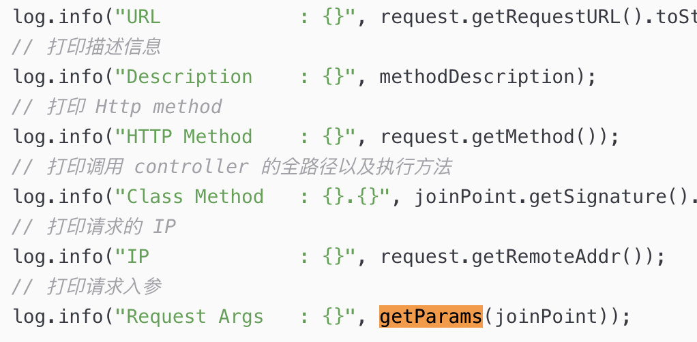
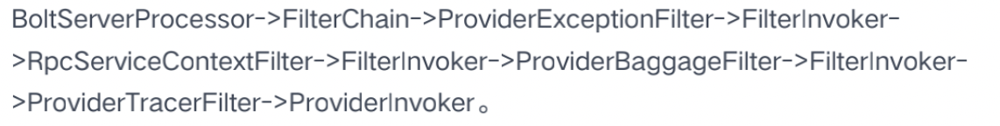

- # 背景
- 目前DFA-Boot对于日志的链路中缺少可以跟踪参数的能力，由于DFA-Boot支持了RPC和HTTP方式的数据传输。故需要在这两种协议的传输日志中添加打印此部分日志的能力，以供开发过程中进行排查。
- # 支持范围
- RPC服务端打印接收到的请求payload和来源
- HTTP服务端切面打印接收到的请求payload和来源
- 日志支持INFO级别
- 提供配置参数开关
	- DFA-RPC添加配置开关：dfa.rpc.tracelog.enabled，默认是false，如果开启则输出。
	- DFA-Web添加配置开关：dfa.web.tracelog.enabled，默认是false，如果开启则输出。
- 日志记录参数若超长则需要截断，默认为200个字符。
	- 可通过使用此配置进行设置
		- dfa.rpc.tracelog.limit 为dfa-rpc中的每个参数的值最长字符.
		- dfa.web.tracelog.limit 为dfa-web中的每个参数的值最长字符.
	-
- # 实现原理
- ## DFA-Web实现
- ### 获取途径
- 可以在请求使用Controller切面来完成此动作，在开始请求的时候获取到HttpServletRequest信息。然后打印以下参数。
	- url ，可以用后面的方法来实现：request.getRequestURL().toString()
	- method，可以用后面的方法来实现：request.getMethod()
	- methodName，可以用后面的方法来实现：joinPoint.getSignature().getDeclaringTypeName() + joinPoint.getSignature().getName()
	  id:: 627cb3ca-8b27-44f0-a56b-066036c67bce
	- remoteAddr，可以用后面的方法来实现：  request.getRemoteAddr(类名和方法名：可以用后面的方法来实现：)
	- params，可以用后面的方法来实现：request.getParams()
-
- ### 输出样式
- 
- 参考文档： [web输出日志](https://blog.csdn.net/HuHao_CSDN/article/details/105048588)
- ### 开关设置
- 当dfa.rpc.tracelog.enabled为true时才打印，并且是INFO级别日志。
- 当param参数值大于dfa.rpc.tracelog.limit 的时候进行截断。后面加上...
-
- ## DFA-RPC实现
### 获取途径
- 查看 [[DFA-RPC调用流程梳理]]的服务端调用章节，我们可知道在下列流程中添加对应的日志即可。
- 
- ### 输出样式
- 
### 开关设置
- 当dfa.rpc.tracelog.enabled为true时才打印，并且是INFO级别日志。
- 当param参数值大于dfa.rpc.tracelog.limit 的时候进行截断。后面加上...