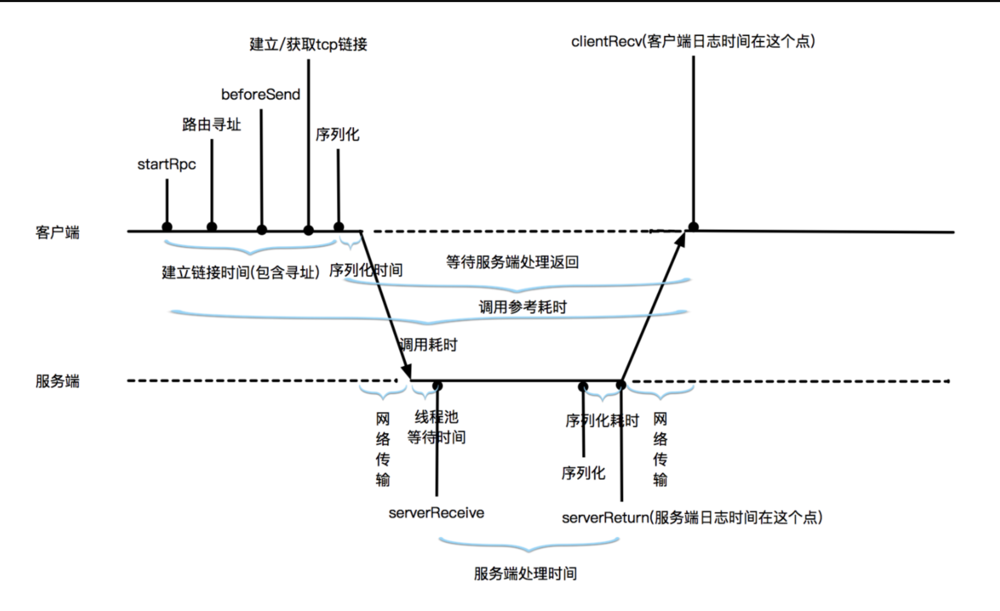

- 本文汇总梳理了 RPC 使用过程中遇到的常见问题及排查思路。
## 使用 RPC 客户端调用服务时报错

**调用服务时报“RPC-02306: 没有获得服务 [{0}] 的调用地址，请检查服务是否已经推送”错误**

排查思路如下：
- 检查服务地址是否推送。
  
  登录客户端，查看  `/home/admin/logs/rpc/sofa-registry.log`  日志，您可以通过服务接口名过滤日志找到最后一次推送记录。如果发现服务端地址没有推送到客户端，建议首先排查服务是否注册成功。例如，以下日志中有可调用目标地址[0]个的记录，则说明  `com.alipay.share.rpc.facade.SampleService`  的服务端地址没有推送到客户端：
  
  ```
  RPC-REGISTRY - RPC-00204:接收 RPC 服务地址：服务名[com.alipay.share.rpc.facade.SampleService:1.0@DEFAULT]
  可调用目标地址[0]个
  ```
- 检查客户端启动时是否收到 RPC Config 推送。
  
  查看  `/home/admin/logs/rpc/rpc-registry.log`  日志，确定最近一次 RPC 客户端的启动时间。您可以根据客户端上次启动时间和服务接口名过滤日志，检查对应的接口是否有  `Receive Rpc Config info`  的记录。如果没有也会导致后续无法调用服务，可以考虑重启客户端。
- 检查服务是否注册成功登录 SOFA 应用中心。
  
  查看服务注册情况，或登录服务端查看  `/home/admin/logs/confreg/config.client.log`  日志。如果有服务发布相关的错误，可根据日志信息进一步排查。
- 检查服务调用是否早于地址推送时间。
  
  如果客户端日志  `sofa-registry.log`  中显示服务地址已经推送，但是 RPC-02306 错误发生的时间在服务地址推送之前，这种情况多发生在调用服务时，客户端应用还没有完成启动。问题原因多为业务系统自己通过定时任务调用服务，或者在 bean 初始化完成后就开始调用服务导致的报错，可通过配置  `address-wait-time`  来解决。
- 检查 RPC 服务端和客户端应用配置信息是否匹配。
  
  分别打开服务端和客户端应用的配置文件  `application.properties` ，查看  `com.alipay.instanceid`  和  `com.antcloud.antvip.endpoint`  参数是否配置相同。如配置不同，RPC 客户端将无法感知 RPC 服务端。
- 检查服务注册中心连接。
  
  运行以下命令以检查客户端和服务端与服务注册中心的连接情况：
  
  ```
  netstat -a |grep 9600
  ```
  
  9600 端口是服务注册中心的监听端口，客户端和服务端与 9600 端口建立长连接，向服务注册中心发布和订阅服务。如果客户端或者服务端与 9600 端口的连接断开，则需要重启应用恢复，并进一步排查端口异常断开的原因。
- 检查 RPC 服务端地址绑定。
  
  登录 RPC 服务端，运行以下命令：
  
  ```
  ps -ef|grep java
  ```
  
  查看进程启动参数  `rpc_bind_network_interface`  或  `rpc_enabled_ip_range`  是否绑定了正确的 IP 地址。
- ## 错误日志中出现“Rpc invocation timeout[responseCommand TIMEOUT]”报错
  
  RPC 调用时序图如下：
- 
-
- **说明 **
  
  有关客户端和服务端各阶段的耗时信息，请参考 [链路追踪](https://help.aliyun.com/document_detail/149914.htm)。
  
  若您调用 RPC 服务超时，在客户端的  `logs/tracelog/middleware_error.log`  日志中，看到如下异常信息：
  
  ```
  2018-07-0613:21:20.463,sofa2-rpc-client,707c27b9153085447746110464663,0,main,timeout_error,rpc,invokeType=sync&uid=&protocol=bolt&targetApp=sofa2-rpc-server&targetIdc=&targetCity=&paramTypes=&methodName=message&serviceName=com.alipay.share.rpc.facade.SampleService:1.0&targetUrl=10.160.34.141:12200&targetZone=&,,com.alipay.sofa.rpc.core.exception.SofaTimeOutException: com.alipay.remoting.rpc.exception.InvokeTimeoutException:Rpc invocation timeout[responseCommand TIMEOUT]! the address is10.160.34.141:12200
  ```
  
  您可以通过如下步骤进行排查：
- **说明 **
  
  有关客户端和服务端各阶段的耗时信息，请参考 [链路追踪](https://help.aliyun.com/document_detail/149914.htm)。
  
  若您调用 RPC 服务超时，在客户端的  `logs/tracelog/middleware_error.log`  日志中，看到如下异常信息：
  
  ```
  2018-07-0613:21:20.463,sofa2-rpc-client,707c27b9153085447746110464663,0,main,timeout_error,rpc,invokeType=sync&uid=&protocol=bolt&targetApp=sofa2-rpc-server&targetIdc=&targetCity=&paramTypes=&methodName=message&serviceName=com.alipay.share.rpc.facade.SampleService:1.0&targetUrl=10.160.34.141:12200&targetZone=&,,com.alipay.sofa.rpc.core.exception.SofaTimeOutException: com.alipay.remoting.rpc.exception.InvokeTimeoutException:Rpc invocation timeout[responseCommand TIMEOUT]! the address is10.160.34.141:12200
  ```
  
  您可以通过如下步骤进行排查：
- **说明 **
  
  有关客户端和服务端各阶段的耗时信息，请参考 [链路追踪](https://help.aliyun.com/document_detail/149914.htm)。
  
  若您调用 RPC 服务超时，在客户端的  `logs/tracelog/middleware_error.log`  日志中，看到如下异常信息：
  
  ```
  2018-07-0613:21:20.463,sofa2-rpc-client,707c27b9153085447746110464663,0,main,timeout_error,rpc,invokeType=sync&uid=&protocol=bolt&targetApp=sofa2-rpc-server&targetIdc=&targetCity=&paramTypes=&methodName=message&serviceName=com.alipay.share.rpc.facade.SampleService:1.0&targetUrl=10.160.34.141:12200&targetZone=&,,com.alipay.sofa.rpc.core.exception.SofaTimeOutException: com.alipay.remoting.rpc.exception.InvokeTimeoutException:Rpc invocation timeout[responseCommand TIMEOUT]! the address is10.160.34.141:12200
  ```
  
  您可以通过如下步骤进行排查：
- 查看是否因服务本身问题导致的超时，如业务代码处理时间过长。
  
  默认情况下，RPC 的超时时间为 3 秒。要确定某个请求的实际处理时间，您可登录服务端查看  `logs/tracelog/rpc-server-digest.log`  日志。根据客户端超时日志中的 traceID，如  `707c27b9153085447746110464663` ，找到服务端处理对应请求的日志。日志格式如下所示：
  
  ```
  2018-07-0613:21:22.441,sofa2-rpc-server,707c27b9153085447746110464663,0,com.alipay.share.rpc.facade.SampleService:1.0,message,bolt,,10.160.33.96,sofa2-rpc-client,,,4001ms,0ms,SofaBizProcessor-12200-0-T46,02,,,1ms,,
  ```
  
  上述日志中服务端业务代码处理时间为 4001 毫秒。
  
  由于 RPC 调用默认的超时时间是 3 秒，如果日志中的耗时大于 3 秒或者非常接近 3 秒，建议首先从服务端本身排查，可能原因如下：
- 服务端业务代码执行慢。
- 服务端本身有外网服务调用，或者服务端又调用了其他 RPC 服务（client > RPC Server A > RPC Server B)，此种情况需要分别排查 A 和 B，确定问题。
- 服务端有数据库操作，如数据库连接耗时、慢 SQL 等。
  
  如因服务端本身原因导致超时，建议调整代码。
- 查看是否因服务端 RPC 线程池耗尽导致的超时。
  
  登录服务端查看  `rpc/tr-threadpool`  日志。如果发生 RPC 线程池队列阻塞，先确认是否发生超时的时间段有业务请求高峰，或者用  `jstack`  查看业务线程是否有等待或者死锁情况，导致 RPC 线程耗尽。更多信息，请参见 [应用维度配置扩展](https://help.aliyun.com/document_detail/149884.html?spm=a2c4g.11186623.6.561.7a6f35f3sJ9j0U)。
- 查看是否因 GC 问题（Garbage Collection，简称 GC），导致线程停止。
  
  某些 GC 类型会触发“stop the world”问题，会将所有线程挂起。若要排查是否是 GC 导致的超时问题，可以通过以下方法开启 GC 日志。
- 方法一：
  
  在  `config/java_opts`  文件中加入以下启动参数，并重新打包发布。
  
  ```
  -verbose:gc -XX:+PrintGCDetails-XX:+PrintGCDateStamps-Xloggc:/home/admin/logs/gc.log
  ```
- 方法二：
- 用  `kill -15`  命令结束服务端进程。
- 手动启动 RPC 服务。
  
  运行  `su admin`  进入 admin 用户，用如下  `nohup`  形式启动 RPC 服务：
  
  ```
  $ nohup java -verbose:gc -XX:+PrintGCDetails-XX:+PrintGCDateStamps-Xloggc:/home/admin/logs/gc.log -Drpc_bind_network_interface=eth0 -Dspring.profiles.active=&{环境标识}-jar /home/admin/app-run/sofa2-rpcserver-service-1.0-SNAPSHOT-executable.jar &
  ```
  
  **说明 **
  
  **工作空间标识** 可登录 [SOFAStack 控制台](https://sofa.console.aliyun.com/#/apconsole/workspace/setting)，然后在左侧导航栏选择 **资源管理** > **工作空间** 查看。
- 等待下次 RPC 超时发生后，查看  `gc.log`  验证超时的时间段是否有耗时较长的 GC，尤其是 Full GC。
- 查看是否因网络延时抖动导致的超时。
  
  您可以通过以下步骤排查：
- 在客户端和服务端运行  `tsar -i 1`  查看问题发生的时间点是否有网络重传。
- 在客户端和服务端同时部署  `tcpdump`  进行循环抓包，当问题发生后分析网络包。
- 在客户端和服务端运行  `ping`  观察是否存在网络延时。
- 确认是否因其他外部因素影响服务器性能，如任务调度、批处理，或者与宿主机上其他虚拟机、容器发生资源争抢。
## 如何打印客户端 RPC 调用统计？

可以参考以下示例语句打印调用  `sofa2-rpc-server`  的应用超过 3 秒的请求总数、服务端IP、服务应用和客户端IP：

```
$ grep sofa2-rpc-server rpc-client-digest.log | awk -F,'{if(int($18)>3000)print $9,$10,$27}'|sort | uniq -c | sort -n
```

实际使用时，请将  `sofa2-rpc-server`  替换成对应的服务端应用名称，并根据日志中处理时长所对应列的具体位置调整  `$18`  数值。打印信息也可以根据需要调整。
## 为什么 SOFABoot 应用已经启动，但服务没有发布成功？

您可以根据以下几个情况进行排查：
- 应用非正常启动
  
  通常可以查看  `health-check`  日志。如果有 error 日志，可以根据相关信息进行排查，常见的故障信息包括：
- redis 没有正确配置。
- 一个服务在本地开启了多个实例。
- Bolt 服务没有启动，并发现端口占用等。
- 注册中心问题
  
  如果应用已经启动，但服务没有发布成功，则按下述步骤排查：
- 查看注册中心内有没有服务被注册， 如果没有，则排除注册中心的故障。
- 查看是否是 ACVIP 的问题。如果排除后，服务还有问题，按下述步骤排查：
- 观察应用容器是否有类似  `/Users/xxx/conf/acvip-java-client-cache/domains/0000X-DSR_HTTP.json`  这样的文件。如果有，可进入该文件查看其内容，一般都是缓存到本地的 DSR 注册中心地址，可自行检查是否有异常。例如：健康检查不通过，IP 没有获取正确等。
- 通过命令判断当前注册中心是否正常，示例如下： `curl -i -XPOST {antvip}:9003/antcloud/antvip/instances/get -d '{"vipDomainName2ChecksumMap":{"000001-DSR_CLOUD":"N"}}'` 。如果不正常，请检查注册中心是否配置正确。
- 服务提供方的运行模式
  
  云上发布时，未修改  `run.mode=DEV`  参数。在 DEV 模式下，将只注册到本地，而不会注册到注册中心里。
## 如何将 Dubbo 内部项目迁移到 SOFABoot 上？

**问题描述：**
- 如何将 Dubbo 内部项目迁移到 SOFABoot 上？
- 如果第三方需要保有 Dubbo，系统要如何设计？
  
  **解决方案：**
  
  系统改造过程中，并不能确保所有关联系统一次性改造完成，会面临需要和历史系统兼容的场景。例如一个服务被改造成 SOFA Bolt 服务后，发现还有调用方依然是依赖 Dubbo 的。那么，一个简单的兼容办法为：这个服务同时暴露 BOLT 和 Dubbo 服务。
  
  在 SOFABoot 中暴露 Dubbo 服务，步骤如下：
- 加入 Dubbo 的 starter 依赖。
  
  示例如下：
  
  ```
  <dependency>
    <groupId>com.alibaba.boot</groupId>
    <artifactId>dubbo-spring-boot-starter</artifactId>
    <version>0.1.1</version>
  </dependency>
  <!-- Dubbo -->
  <dependency>
    <groupId>com.alibaba</groupId>
    <artifactId>dubbo</artifactId>
    <version>2.6.4</version>
  </dependency>
  <!-- Spring Context Extras -->
  <dependency>
    <groupId>com.alibaba.spring</groupId>
    <artifactId>spring-context-support</artifactId>
    <version>1.0.2</version>
  </dependency>
  ```
- 配置  `application.properties` 。
  
  示例如下：
  
  ```
  ################ common configuration ##############
  spring.application.name=bank-dubbo-provider
  logging.level.com.dubbo.example=INFO
  logging.path=./logs
  ################ dubbo configuration ##############
  demo.service.version =1.0.0
  dubbo.application.id = bank-dubbo-provider
  dubbo.application.name = bank-dubbo-provider
  ################ sofa configuration ##############
  run.mode=DEV
  com.alipay.sofa.rpc.bolt-port=12201
  # shared middleware
  com.alipay.env=shared
  com.alipay.instanceid=IPYJUBMB231N
  com.antcloud.antvip.endpoint=100.103.1.174
  com.antcloud.mw.access=uPxHLxsMmstcQCNWEh
  com.antcloud.mw.secret=TyMlUB9uGRMzcc2pG0dMv6xzUXCMA1WI
  ```
- 添加 Dubbo 服务发布。
  
  示例如下：
  
  ```
  <?xml version="1.0" encoding="UTF-8"?>
  <beans xmlns="http://www.springframework.org/schema/beans"
    xmlns:xsi="http://www.w3.org/2001/XMLSchema-instance"
    xmlns:sofa="http://schema.alipay.com/sofa/schema/slite"
    xmlns:dubbo="http://dubbo.apache.org/schema/dubbo"
    xmlns:context="http://www.springframework.org/schema/context"
    xsi:schemaLocation="http://www.springframework.org/schema/beans
    http://www.springframework.org/schema/beans/spring-beans-3.0.xs
    http://schema.alipay.com/sofa/schema/slite http://schema.alipay.com/sofa/slite.xsd http://www.springframework.org/schema/context http://www.springframework.org/schema/context/spring-context.xsd http://dubbo.apache.org/schema/dubbo http://dubbo.apache.org/schema/dubbo/dubbo.xsd">
    <!-- dubbo zookeeper configuration -->
    <dubbo:registry address="zookeeper://127.0.0.1:2181"/>
    <dubbo:protocol name="dubbo" port="20880"/>
    <!-- bean define -->
    <bean id="dubboService" class="com.dubbo.example.service.DubboServiceImpl"/>
    <!-- sofa service -->
    <sofa:service interface="com.dubbo.example.facade.DubboService" ref="dubboService" unique-id="sofaDubboService">
        <sofa:binding.bolt/>
    </sofa:service>
    <!-- dubbo service -->
    <dubbo:service interface="com.dubbo.example.facade.DubboService" ref="dubboService" version="1.0.0"/>
  </beans>
  ```
  
  **说明 **
  
  服务需要引入 Dubbo 的 schema，这样基于 Dubbo 的定义才会被显示，并且 Dubbo 的注册中心是 zk，也需要配置。
- 更新 main 函数，开启 Dubbo。
  
  示例如下：
  
  ```
  @ImportResource({"classpath*:META-INF/bank-dubbo-provider/*.xml"})
  @org.springframework.boot.autoconfigure.SpringBootApplication
  @EnableDubbo
  **public** **class** **SOFABootSpringApplication**{
     **private** **static** **final** **Logger** logger =LoggerFactory.getLogger(SOFABootSpringApplication.class);
     **public** **static** **void** **main**(String[] args){
          **SpringApplication** springApplication =**new** **SpringApplication**(SOFABootSpringApplication.class);
          **ApplicationContext** applicationContext = springApplication.run(args);
     }
  }
  ```
## RPC 调用时报“02306，服务无法向注册中心发布”错误。

**问题现象：**

调用时错误日志如下：查看 RPC 注册中心日志，却未发现注册中心，示例如下：发布服务无效，查看健康检查日志，发现问题如下：**故障原因：**

Bolt 端口 12200 被占用。

**解决方案：**

更换端口或者把本地占用端口的服务关闭。
## 进行 RPC 调用时出现“com.alibaba.com.caucho.hessian.io.HessianFieldException:’xxxx’ could not be instantiated”报错

**问题分析：**通过对上面的 2 个日志进行分析，结合日志的提示，可以得出下述结论：
- 进行 RPC 调用的时候，参数序列化失败。
- `java.util.Local`  这个类不能实例化，原因是 Local 这个类在 init 的时候，出现了空指针的异常。
  
  **解决方案：**
  
  修改序列化方法。
## 如何解决应用启动失败，服务无法注册的问题？

**问题描述：**

应用依赖了一些 SOFA 组件，但在本地环境中仅希望测试 RPC，如何处理下述问题：
- 应用启动失败
- 服务无法注册
  
  **解决方案：**
  
  健康检查机制会在项目启动的时候对所有组件进行探活，如果此时引用了 DDCS（Distributed Dynamic Configuration Service） 或者其它组件，会出现应用启动正常，但 RPC 无法在本地注册的现象。此时，如果业务暂时没有用到这些组件，可以在 healthcheck 时略过这些检查。本质原因是这些组件会到 antvip 中寻找组件地址，而此时应用并不在云上，所以会失败。具体操作如下：
  
  在  `application.properties`  中添加下述配置，以略过所有组件的健康检查。
  
  ```
  com.alipay.sofa.healthcheck.skip.component=true
  ```
  
  **重要 **
  
  此方案只建议在测试中使用，线上环境一定要打开健康检查。
## SOFARest 接口在上传文件时，文件超过 10 MB 时会报错，如何处理？

**问题现象：**

SOFARest 接口在上传文件时，文件超过 10 MB 时会报错，报错信息如下：

```
ERROR org.jboss.resteasy.core.ExceptionHandler- failed to execute
javax.ws.rs.NotFoundException:Couldnot find resource **for** full path: http://unknown/bad-request
  at org.jboss.resteasy.core.registry.ClassNode.match(ClassNode.java:73)
  at org.jboss.resteasy.core.registry.RootClassNode.match(RootClassNode.java:48)
```

**排查步骤：**
- 在日志里将该报错打开，将 Netty 中 HTTP 相关类的日志改成 debug 模式。
  
  示例如下：
  
  ```
  logging.level.io.netty.handler.codec.http.HttpObjectAggregator=DEBUG
  ```
- 获取具体报错的原因，例如  `Failed to send a 413 Request Entity Too Large` 。
- 在  `application.properties`  文件里设置相应参数。
  
  ```
  com.alipay.sofa.rpc.RestMaxRequestSize=104857600
  ```
  
  假如应用的内存容量默认比较小，比如 1 GB 或者 2 GB，而 Netty 的 REST 所请求的 Payload 是放在 DirectMemory 里的，且该 DirectMemory 有个最大值，默认是系统 JVM 初始化时所申请内存大小。如果上传大文件时发生了 OOM 或者 DirectMemory 内存溢出的错误，需要进行下述处理：
- 确定当前系统的内存大小是否能够承受所传大文件。
- 确认运行时内存或者 DirectMemory 的最大值。
- 如果可以优化，请选择分段上传。
## 客户端调用远端服务时有大量的超时，但服务端的响应正常，且耗时很少，该如何排查？

您可以排查以下几个方面：
- 线程池发生了阻塞
  
  该问题一般在多级链路调用时才会发生。比如：A 调用 B 再调用 C，B 作为服务端的线程发生了阻塞，则需要查看 B 的  `tr-threadpool.log`  日志。
- GC 处理遇到严重故障
  
  框架遇到 GC 的故障很少，但也不排除在某些特定的场景会发生的概率。一般查看  `logs/stdout.log`  日志文件，并据此查看 CMS-remark、YG、ParNew 等指标，它们都标识着 STW，从而会导致 JVM 停顿。
- 硬件磁盘 IO 故障
  
  一般通过  `tsar -I 1`  查看下一分钟内的 IO 请求次数。在某些场景下，如果磁盘 IO 较高会影响到整个系统的性能。
- 网络故障
  
  网络问题一般都很难定位，这里介绍一个较为常见的网络设备故障问题，即防火墙会剔除不活跃（90s）链接或 LVS 故障切流量剔除链接时，均不会向客户端 Socket 发 RST 包，这样会导致客户端存在脏 Socket。
  
  某台机器请求一个具体 IP 的服务，该服务流量不大，所以请求频率很低，几十分钟甚至几小时一次。当超时时，会超时一次即断开连接，或连续超时 n 次后链接才断开。超时一次，应该是防火墙断开的链接；超时 n 次，则是 LVS 断开的链接。
  
  为什么超时 n 次之后才断开连接？因为 Socket 已经是脏链接，在写数据的时候，数据仅写到了 TCP Buffer 中，没有真正写出去，而这个时候 OS 并不会给上层使用者一个中断，仅当 TCP Buffer 写满之后，才会出现  `org.apache.mina.common.WriteTimeoutException` 。TCP Buffer 在服务器上一般是 64 KB。一般这种问题，可以配置心跳来排除故障，或结合故障剔除功能来排查。
## SOFA 客户端调用耗时较长的服务时，需要注意什么？

**问题描述：**
- SOFA 客户端调用耗时较长的服务时，需要注意什么？
- 如果设置了超长时间，没有生效，怎么排查错误？
  
  **排查思路：**
  
  服务发起方如果发现对方是一个耗时较长的服务，则需要配置一个比较合理的超时时间，否则，要判断该接口是不是需要一个 oneway 方式去执行。如果必须等待结果，且触发后发现，无论如何配置，超时时间都无法生效，则需检查防火墙或负载均衡器是否在上游配置了连接超时控制。
## RPC 本地调用，修改注册中心路径的方式有哪些？

目前只能是设置环境变量方式： `System.setProperty("user.home","本地目录")` 。企业版会把注册中心的路径配置包装起来，SOFA 在启动的时候会默认读这个  `user.home` 。在配置的时候需要多添加两个字符（/），因为框架会省掉前两个字符，从第三个字符开始读取，例如： `user.home=//c://hulu` 。

**重要 **

这个问题，只会在本地开发的时候会遇到。云上开发不需要关心注册中心。 企业版是通过 antvip 来获取一个健康的注册中心的地址，然后会构建 dsr://ip:port，同时，企业版将这个构建过程包装在了框架里。
## 有没有 Resteasy 的 key-value 方法请求示例？

示例如下：
- SpringMVC 的 Controller 请求方法：
- URL： `http://localhost:8080/test?str=aaa`
- 代码配置，示例如下：
  
  ```
  @GetMapping("/test")
  **public** String **testParam**(@RequestParam("str") String str){
    **return** str;
  }
  ```
- Resteasy 的 GET 请求：
- 类型一：
- URL： `http://localhost:8341/webapi/users/test/xiaoming`
- 代码配置，示例如下：
  
  ```
  @Path("/webapi/users")
  **public** **interface** **SampleRestFacade**{
    @GET
    @Path("/test/{userName}")
    **public** RestSampleFacadeResp<DemoUserModel> **user**(@PathParam("userName")String userName)**throws** CommonException;
  }
  ```
- 类型二（key-value）
- URL： `http://localhost:8341/webapi/users/test?userName=xiaoming`
- 代码配置，示例如下：
  
  ```
  @Path("/webapi/users")
  **public** **interface** **SampleRestFacade**{
      @GET
      @Path("/test")
      **public** RestSampleFacadeResp<DemoUserModel> **userInfo**(@QueryParam("userName") String userName) **throws** CommonException;
  }
  ```
- `@FormParam` ：将表单中的字段映射到方法调用上，此类方式提交方式一般为 Post。
## RPC Tracer 日志格式说明

日志格式请参见 [SOFARPC 日志](https://help.aliyun.com/document_detail/151860.html#h2-sofarpc-4)。
## 有没有泛化调用的示例？

SOFARPC 在框架层面提供了通用的接口方法和类型：
- 服务的接口名：通过服务定义设置。
- 方法名和参数列表：通过  `$invoke`  或  `$genericInvoke`  传入。
- 自定义类型：使用  `GenericObject` 。
  
  其中几个特别需要注意事项为：
- `$invoke`  方法：只用于参数类型，可以被当前应用的类加载器加载，如果只有基础类型，则可以使用此方法。
- `$genericInvoke`  结合  `GenericObject` ，当参数类型无法被当前应用的类加载器加载时，使用该方法。
- `argTypes`  必须传递接口声明的参数类型，不可使用子类类型。
- 调用  `$genericInvoke`  接口时，会将除以下包以外的其他类序列化为  `GenericObject` ：  `"com.sun","java","javax","org.ietf","org.ogm","org.w3c","org.xml","sunw.io","sunw.util"`
- `GerericContext`  暂时只用于单元化场景。
- `GenericObject` 、 `fields`  的 value 也可以是一个  `GenericObject` 。
  
  SOFARPC 的泛化调用，示例如下：
- 服务方：
- 服务、接口和类型定义：
  
  ```
  // 服务定义
  <sofa:reference interface="com.alipay.sofa.rpc.api.GenericService" id="xxxGenericService">
    <sofa:binding.tr>
        <sofa:global-attrs generic-interface="目标服务接口的fullname"/>
    </sofa:binding.tr>
  </sofa:reference>
    
    // 接口方法定义
    **public** **interface** **GenericService**{
        Object $invoke(String methodName,String[] argTypes,Object[] args) **throws** GenericException;
        Object $genericInvoke(String methodName,String[] argTypes,Object[] args) **throws** GenericException;
        Object $genericInvoke(String methodName,String[] argTypes,Object[] args,GenericContext context) **throws** GenericException;
        <T> T $genericInvoke(String methodName,String[] argTypes,Object[] args,Class<T> clazz) **throws** GenericException;
        <T> T $genericInvoke(String methodName,String[] argTypes,Object[] args,Class<T> clazz,GenericContext context) **throws** GenericException;
    }
    // 类型定义
    **public** **final** **class** **GenericObject** **implements** **Serializable**{
        **private** String type;
        **private** Map<String,Object> fields =**new** **HashMap**<String,Object>();
    }
  ```
- 服务方的接口、自定义类型和发布泛化调用的配置：
  
  ```
  **public** **interface** **PeopleService**{
    String **hello**();
    String **hello**(String arg);
    People **hello**(People people);
    String[] hello(String[] args);
    People[] hello(People[] peoples);
  }
  **public** **class** **People**{
    **private** String name;
    **private** **int** age;
   //getter和setter方法
  }
  <!--发布泛化接口的配置-->
  <bean id="genericService" class="com.aliyun.gts.financial.product.demo.rpc.server.service.PeopleServiceImpl"/>
  <sofa:service ref="genericService" interface="com.aliyun.gts.financial.product.demo.service.facade.PeopleService">
     <sofa:binding.bolt/>
  </sofa:service>
  ```
- 客户端：
- 定义泛化的服务，并设置正确的目标服务接口。
  
  ```
  <!--调用泛化接口的配置-->
  <sofa:reference interface="com.alipay.sofa.rpc.api.GenericService" id="genericFacade">
     <sofa:binding.bolt>
          <sofa:global-attrs generic-interface="com.aliyun.gts.financial.product.demo.service.facade.PeopleService"/>
     </sofa:binding.bolt>
  </sofa:reference>
  ```
  
  **重要 **
  
  reference 里的 interface 需要填写框架定义的 GenericService 接口。 global-attrs 里的 generic-interface 才是填写真正的目标服务接口。 reference 里的 interface 都是 GenericService，如果要泛化调用多个不同的服务接口，可通过 reference 的 id 来区分。
- 通过 GenericService 的方法来调用目标方法。
  
  ```
  @Controller
    **public** **class** **TestController**{
        **private** **String** peoplePath ="com.aliyun.gts.financial.product.demo.rpc.bean.People";
        **private** **static** **final** **Logger** logger =LoggerFactory.getLogger(TestController.class);
        /**
         * 默认ByName注入
         */
        @Autowired
        **private** GenericService genericFacade;
        /**
         * 无参场景使用$invoke
         * $invoke方法只用于参数类型可以被当前应用的类加载器加载，如果只有基础类型可以使用此方法
         * 泛化调用 String hello()方法
         */
        @GetMapping("/test/invokeWithoutArgs")
        @ResponseBody
        @Produces("application/json;charset=UTF-8")
        **public** **void** **invokeWithoutArgs**(){
            **String** result =(String) genericFacade.$invoke("hello",
                    newString[]{},
            **new** **Object**[]{});
            **if**(logger.isInfoEnabled()){
                logger.info("Generic invoke result: {}", result);
            }
        }
        /**
         * $invoke调用，有参数
         * 泛化调用 String hello(String arg);
         */
        @GetMapping("/test/invokeBasicTypeMethod")
        @ResponseBody
        @Produces("application/json;charset=UTF-8")
        **public** **void** **invokeBasicTypeMethod**(){
            **String** result =(String) genericFacade.$invoke(
                    "hello",
                    **new** **String**[]{String.class.getName()},
            **new** **Object**[]{"BasicType"});
            **if**(logger.isInfoEnabled()){
                logger.info("Generic invoke result: {}", result);
            }
        }
        /**
         * $genericInvoke调用，用于参数类型无法被当前应用的类加载器加载的场景
         * 泛化调用 People hello(People people);
         */
        @GetMapping("/test/invokeCustomTypeMethod")
        @ResponseBody
        @Produces("application/json;charset=UTF-8")
        **public** **void** **invokeCustomTypeMethod**(){
            // 构造函数中指定全路径类名
            **GenericObject** genericPeopleObject =**new** **GenericObject**(peoplePath);
            // 调用putField，指定field值
            genericPeopleObject.putField("name","Lilei");
            genericPeopleObject.putField("age",15);
            **Object** result = genericFacade.$genericInvoke(
                    "hello",
                    newString[]{peoplePath},
            **new** **Object**[]{genericPeopleObject});
            // 返回的类型还是GenericObject类型
            **if**(logger.isInfoEnabled()){
                logger.info("Type of result: {}", result.getClass().getName());
            }
        }
        /**
         * $genericInvoke调用，参数为数组
         * 泛化调用 String[] hello(String[] args);
         */
        @GetMapping("/test/invokeBasicArrayTypeMethod")
        @ResponseBody
        @Produces("application/json;charset=UTF-8")
        **public** **void** **invokeBasicArrayTypeMethod**(){
            String[] results =(String[]) genericFacade.$genericInvoke(
                    "hello",
                    **new** **String**[]{**new** **String**[]{}.getClass().getName()},
            **new** **Object**[]{**new** **String**[]{"BasicArrayType"}});
            // 返回的类型还是GenericObject类型
            **if**(logger.isInfoEnabled()){
                **for**(String result : results){
                    logger.info("Generic invoke result: {}", result);
                }
            }
        }
        /**
         * $genericInvoke调用，自定义类型数组
         * People[] hello(People[] peoples);
         */
        @GetMapping("/test/invokeCustomArrayTypeMethod")
        @ResponseBody
        @Produces("application/json;charset=UTF-8")
        **public** **void** **invokeCustomArrayTypeMethod**(){
            **GenericObject** genericObject =**new** **GenericObject**(peoplePath);
            // 调用 putField，指定field值
            genericObject.putField("name","HanMeimei");
            genericObject.putField("age",14);
            // 服务端反射，class.forName对于数组类型的格式有特定要求
            **String** genericObjArrayType ="[L"+ peoplePath +";";
            GenericObject[] genericObjArray =**new** **GenericObject**[]{genericObject};
            **GenericArray** resultArray =(GenericArray) genericFacade.$genericInvoke("hello",
                    **new** **String**[]{genericObjArrayType},
            **new** **Object**[]{genericObjArray});
            **for**(Object result : resultArray.getObjects()){
                logger.info(result.toString());
            }
        }
    }
  ```
## 如何使用泛化调用？

目前提供了两种方法：
- `$invoke` ：仅支持方法参数类型在当前应用的 ClassLoader 中存在的情况。
- `$genericInvoke` ：支持方法参数类型在当前应用的 ClassLoader 中不存在的情况。
  
  具体使用，示例如下：
- 服务方：
- 服务引用，示例如下：
  
  ```
  <!-- 引用 BOLT 服务 -->
  <sofa:referenceinterface="com.alipay.sofa.rpc.api.GenericService"id="genericService">
    <sofa:binding.bolt>
        <sofa:global-attrsgeneric-interface="com.alipay.test.SampleService"/>
    </sofa:binding.bolt>
  </sofa:reference>
  ```
- 服务端服务定义，示例如下：
  
  ```
  /*** Java Bean*/
  **public** **class** **People**{
    **private** String name;
    **private** **int**    age;
    // getters and setters
  }
  /** * 服务方提供的接口 */
  **interface** **SampleService**{
    String **hello**(String arg);
    People **hello**(People people);
  }
  ```
- 客户方：
- 泛化调用，示例如下：
  
  ```
  /** * 消费方测试类。 */
    **public** **class** **ConsumerClass**{
        GenericService genericService;
        **public** **void** **do**(){
            // $invoke 仅支持方法参数类型在当前应用的 ClassLoader 中存在的情况。
            genericService.$invoke("hello",**new** **String**[]{String.class.getName()},**new** **Object**[]{"I'm an arg"});
  
            // $genericInvoke 支持方法参数类型在当前应用的 ClassLoader 中不存在的情况。      
            //构造参数。
            **GenericObject** genericObject =**new** **GenericObject**("com.alipay.sofa.rpc.test.generic.bean.People");//构造函数中指定全路径类名
            genericObject.putField("name","Lilei");// 调用 putField，指定 field 值。
            genericObject.putField("age",15);
            // 进行调用，不指定返回类型，返回结果类型为 GenericObject。
            **Object** obj = genericService.$genericInvoke("hello",**new** **String**[]{"com.alipay.sofa.rpc.test.generic.bean.People"},**new** **Object**[]{ genericObject });
            Assert.assertTrue(obj.getClass()==GenericObject.class);
            // 进行调用，指定返回类型。
            **People** people = genericService.$genericInvoke("hello",**new** **String**[]{"com.alipay.sofa.rpc.test.generic.bean.People"},**new** **Object**[]{ genericObject },People.class);
  
            // LDC 架构下的泛化调用使用。
            // 构造 GenericContext 对象。
            **AlipayGenericContext** genericContext =**new** **AlipayGenericContext**();
            genericContext.setUid("33");
            // 进行调用。
            **People** people = genericService.$genericInvoke("hello",**new** **String**[]{"com.alipay.sofa.rpc.test.generic.bean.People"},**new** **Object**[]{ genericObject },People.class, genericContext);
  }
  ```
  
  **重要 **
  
  调用  `$genericInvoke(String methodName, String[] argTypes, Object[] args)` 接口，会将除  `com.sun` 、 `java` 、 `javax` 、 `org.ietf` 、 `org.ogm` 、 `org.w3c` 、 `org.xml` 、 `sunw.io` 、 `sunw.util`  包以外的其他类序列化为 GenericObject。
## 泛化调用的使用场景有哪些？

泛化调用提供了让客户端，在不需要依赖服务端接口的情况下，也能发起调用的能力。在 Bolt 通信协议下使用 Hessian2 作为序列化协议，是目前 SOFARPC 的泛化调用仅支持的方式。

泛化调用的常见场景：

在开发中遇到一些第三方应用不想要依赖我们自己开发的依赖接口 JAR，但也想通过某种方式发起调用，或者更进一步，做一个非依赖 JAR 的简单微服务网关。
## 如何针对 RPC 请求做一些定制化处理，比如白名单过滤？

可通过过滤器的方式进行 RPC 接口过滤，比如 IP 黑白名单的过滤、Token 的验证等。

白名单过滤的实现步骤如下：
- 继承 SOFA 的 Filter 抽象类，实现里面的 invoke 方法：
  
  ```
  @Component
    **public** **class** **WhiteIpFilter** **extends** **Filter**{
        @Value("${security.firewall.whiteIps}")
        **private** String whiteIpList;
  
        @Override
        **public** **boolean** **needToLoad**(FilterInvoker invoker){
               **return** true;
        }
        @Override
        **public** SofaResponse **invoke**(FilterInvoker invoker,SofaRequest request) **throws** SofaRpcException{
            **RpcInternalContext** context =RpcInternalContext.getContext();
            **InetSocketAddress** remoteAddress = context.getRemoteAddress();
            **finalString** remoteIp = remoteAddress.getHostString();
            **if**(whiteIpList.contains(remoteIp)){
                **return** invoker.invoke(request);
            }**else**{
                **SofaResponse** sofaResponse =**new** **SofaResponse**();
                sofaResponse.setErrorMsg("非法IP: "+ remoteIp +" 访问，请联系管理员。");
                **return** sofaResponse;
            }
        }
    }
  ```
- 在需要白名单验证的接口上配置过滤器：
  
  ```
  <sofa:service interface="cloud.provider.facade.CallerService" ref="callerService">
   <sofa:binding.bolt>
        <sofa:global-attrs filter="whiteIpFilter"/>
   </sofa:binding.bolt>
   <sofa:binding.rest/>
  </sofa:service>
  ```
## 是否有文件上传下载的示例代码？

SOFARPC 的 REST 协议底层使用的是 Resteasy，可以实现文件上传下载。

主要步骤如下：
- 声明 Facade 接口：
  
  ```
  **public** **interface** **FileServiceFacade**{
   @GET
   @Path("/files/{fileName}")
   @Produces("text/plain")
   Response **downloadFile**(@PathParam("fileName")String fileName) **throws** Exception;
   @POST
   @Path("/files")
   @Consumes("multipart/form-data")
   Response **uploadFile**(MultipartFormDataInput input) **throws** IOException;
  }
  ```
- 实现下载方法：
  
  ```
  @**Ocerride**
    public **Response** **downloadFile**(**String** fileName)throws **Exception**  {
          // 指定一个存放文件的目录。 
          final **String** dir="/destdir/" 
          // 判断文件请求是否为空。
          **if**(fileName == null  || fileName.**isEmpty**( )) {
                **ResponseBuilder**  response = **Response**.**status**(**Status**.BAD_REQUEST);
                **return** response.**build**( );
  }
    // 文件名为 utf-8。
    **String** utfFlieName = **URLDecoder**.**decode**(fileName, "utf-8");
    **File** file = **new** **File**(dir + utfFilename);
   // 判断文件是否存在。
    **if** (!file.**exists**( )) {
         **ResponseBuilder** response = **Response**.**ok**((object)file);
         // 设置请求头。
         response.**header**("Content-Disposition",  "attachment; filename=" + utfFileName);
         // 下载响应。
         **return** response.**builde**( );
  }
  ```
- 实现上传方法：
  
  ```
  @Override
    **public** Response **uploadFile**(MultipartFormDataInput input)**throws** IOException{
        **final** **String** UPLOAD_FILE_PATH ="/Users/yuanshaopeng/Desktop/temp/";
        Map<String,List<InputPart>> uploadForm = input.getFormDataMap();
        // httpclient
        // Get file name
        //String fileName = uploadForm.get("fileName").get(0).getBodyAsString();
        // Get file data to save
        //List<InputPart> inputParts = uploadForm.get("attachment");
        // http mode
        List<InputPart> inputParts = uploadForm.get("uploadedFile");
        **String** fileName ="";
        **for**(InputPart inputPart : inputParts){
            **try**{
                @SuppressWarnings("unused")
                MultivaluedMap<String,String> header = inputPart.getHeaders();
                fileName = getFileName(header);
                **byte**[] bytes =IOUtils.toByteArray(inputPart.getBody(InputStream.class,null));
                log.info("上传文件大小："+ bytes.length);
                **File** desFile =**new** **File**(UPLOAD_FILE_PATH + fileName);
                FileUtils.writeByteArrayToFile(desFile, bytes);
                System.out.println("Success !!!!!");
            }**catch**(Exception e){
                e.printStackTrace();
            }
        }
        **return** Response.status(200).entity("Upload file name : "+ fileName).build();
    }
  
    **private** String **getFileName**(MultivaluedMap<String,String> header){
        String[] contentDisposition = header.getFirst("Content-Disposition").split(";");
        **for**(String filename : contentDisposition){
            **if**((filename.trim().startsWith("filename"))){
                String[] name = filename.split("=");
                **String** finalFileName = name[1].trim().replaceAll("\"","");
                **return** finalFileName;
            }
        }
        **return** "unknown";
    }
  }
  ```
## 如何实现一个不依赖 Facade 接口的服务网关？

一般实现思路为：
- 通过通用的 RESTful 协议进行接入。
- 后端根据泛化接口对传入数据进行解析。
- 通过代理的过滤器指定路由配置。
  
  具体可以参考 spring-cloud-gateway 的过滤器设计和 SOFABolt 协议的泛化设计。可能需要下述扩展：
- 动态路由
- 注册中心联动
- 缓存设计
- 自动代码生成等
## 如何实现 RPC 请求携带数据进行传递？

**重要 **

默认该功能是关闭的，开启后会影响性能，请尽量避免使用。

实现步骤如下：
- 开启配置。
  
  在  `resource`  目录下添加  `rpc-config.json`  文件。
  
  ```
  {"invoke.baggage.enable":true}
  ```
- 代码实现。
  
  示例如下：
  
  ```
  System.out.println(RpcInvokeContext.isBaggageEnable());
  **RpcInvokeContext** context =RpcInvokeContext.getContext();
  context.putRequestBaggage("hellod","lolo");
  ```
  
  **说明 **
  
   `RpcInvokeContext`  是一个 RPC 执行上下文，在这个上下文中，我们可以向  `RequestBaggage`  里添加数据，且数据必须是字符串类型。
## 如何设置 SOFARPC 服务暴露的端口？

在 SOFARPC 服务中，协议默认端口的约定为：
- BOLT 协议：12200
- REST 协议：8341
  
  因此，您可以在  `/resources/config/application.properties`  里设置参数来实现服务暴露的端口，示例如下：
  
  ```
  com.alipay.sofa.rpc.bolt.port=12202
  com.alipay.sofa.rpc.rest.port=8765
  ```
## 如果一个服务有多个实现，服务在发布和引用的时候该如何处理？

一个服务如果有多个实现，可以在 RPC 暴露服务和引用服务的地方配置一个  `unique-id`  来作为它的唯一标识。示例如下：

```
<!-- 服务一 -->
<sofa:service ref="sampleServiceBean1" interface="com.alipay.APPNAME.facade.SampleService" unique-id="service1">
   <sofa:binding.bolt/>
</sofa:service>
<!-- 服务二 -->
<sofa:service ref="sampleServiceBean2" interface="com.alipay.APPNAME.facade.SampleService" unique-id="service2">
  <sofa:binding.bolt/>
</sofa:service>
```
## RPC 服务超时控制，有哪些参数可以配置？

RPC服务在发布和引用时都有超时控制的配置，方法也可以做超时控制，其超时时间的优先级为：引用服务的方法超时 > 引用服务的全局超时时间 > 服务发布者的方法超时 > 服务发布者的全局超时时间。示例如下：

```
<sofa:binding.bolt>
   <sofa:global-attrs timeout="5000"/>
   <sofa:method name="message" type="future" timeout="25000"/>
</sofa:binding.bolt>
```
## 当接口以 RESTful 协议暴露时，需要注意哪些事项？

需要注意下述事项：
- 首先是需要明确中间件使用的版本，目前推荐 sofaboot-enterprise 的版本是 3.4.*，在使用该版本时，如果要使用 RESTful 接口进行开发时，只需要引入 RPC 对应的 starter 包依赖即可，无需再引入 REST 的 starter 依赖，否则会启动两个 RESTful 服务端，导致 8341 端口被占用。
- 在使用 REST 接口开发时，需要在接口上暴露 Path 和 WS 相关的注解，否则服务不知道具体的请求是什么。具体的 WS 注解使用请参见 [WS 注解使用](https://docs.jboss.org/resteasy/docs/3.6.3.Final/userguide/html/Using_Path.html)。
## 一个服务如何同时暴露 RESTful 和 Bolt 两种协议？

发布服务时直接同时声明两种协议的  `binding`  即可，如下所示：

```
<bean id="demoServiceImpl" class="com.alipay.sofa.samples.rpc.DemoServiceImpl"/>
<sofa:service ref="demoServiceImpl" interface="com.alipay.sofa.samples.rpc.DemoService">
   <sofa:binding.rest/>
   <sofa:binding.bolt/>
</sofa:service>
```
## dev 环境 RPC 调用出现“RPC-02306: Can not get the service address of service”报错

**问题现象：**

dev 环境 RPC 调用出错，日志  `middleware_error.log`  中出现找不到服务地址 URL 的报错。

**问题原因：**

属性配置中打开了直连开关，而代码中配置的 URL 与实际 RPC 服务地址不一致。
- `application-dev.properties`  中配置  `run.mode=test` 。
- 代码中配置  `test-url=“${servicename_tr_service_ur}”` 。
- `servicename_tr_service_ur`  指向的地址与实际的 RPC 服务地址不符。
- RPC provider 与 consumer 工程的 SOFABoot 版本不一致。
  
  示例如下：
  
  **解决方案：**
  
  在  `application-dev.properties`  中注释掉  `run.mode=test`  ，或者将 RPC provider 与 consumer 工程的 SOFABoot 版本升级至同一版本。详情请参见 [SOFABoot 版本说明](https://help.aliyun.com/document_detail/133205.htm?spm=a2c4g.11186623.2.17.66fd296eRurvKH)。
  
  ---
## 每次 RPC 调用都耗时很长，明显超时却不报超时异常

**问题现象：**

SOFA RPC 使用 REST 接口触发 RPC 的泛化调用，每次触发都需要 30 秒的时间，且不报超时异常。从业务日志中可以看出，开始处理业务和结束业务之间确实花了 30 秒。

**问题原因：**

可能由于 DNS 配置错误，导致超时。

**解决方案：**

在  `/etc/hosts`  中添加 IP 与主机名的映射，尝试解决该问题。

---
## RPC 注册不成功

**问题现象**

RPC 注册不成功。

**问题原因**

 `application.properties`  文件中的  `run.mode`  设置成了  `dev` 。

**解决方案**

删除  `run.mode`  配置或者将其设置成  `normal` 。

---
## RPC 应用启动时出现“Can't find BindingConverter of type binding.tr”报错

**问题现象：**

RPC 应用启动时出现如下报错：

```
Causedby: org.springframework.beans.factory.BeanCreationException:Error creating bean with name 'secretFacade':Invocation of init method failed; nested exception is com.alipay.sofa.runtime.api.ServiceRuntimeException:Can't find BindingConverter of type binding.tr
```

**问题原因：**

 `rpc-enterprise-sofa-boot-starter`  被注释掉了，而这个 JAR 包提供了如下 binding：
- `rpc-enterprise-sofa-boot/3.2.2/rpc-enterprise-sofa-boot-3.2.2.jar!/com/alipay/boot/sofarpc/converter/TrBindingConverter.class`
- `rpc-sofa-boot/3.2.2/rpc-sofa-boot-3.2.2.jar!/com/alipay/sofa/rpc/boot/runtime/converter/BoltBindingConverter.class` 
  
  **解决方案：**
  
  引入  `rpc-enterprise-sofa-boot-starter`  JAR 包。
  
  ---
## Tr 接口找不到服务地址

**问题原因：**

仅客户端迁移至了共享中间件，服务端并未迁移。

**解决方案：**

将服务端迁移到共享中间件。
## RPC 出现重复发布的报错

**问题现象：**

具体报错信息如下：

```
java.util.concurrent.ExecutionException: com.alipay.sofa.rpc.core.exception.SofaRpcRuntimeException: RPC-010010014: KEY 为 [bolt://com.aliyun.fsi.insurance.aboss.rule.facade.AbossRuleFacade:] 的 Consumer config 重复发布超过了 [3] 次.也许这是一个错误的配置导致的,请检查. 
at java.util.concurrent.FutureTask.**report**(**FutureTask**.java:122)
at java.util.concurrent.FutureTask.**get**(**FutureTask**.java:192)
at **SingelFormula**.**main**(**SingelFormula**.java:47)
**Caused** by: com.alipay.sofa.rpc.core.exception.SofaRpcRuntimeException: RPC-010010014: KEY 为 [bolt://com.aliyun.fsi.insurance.aboss.rule.facade.AbossRuleFacade:] 的 Consumer config 重复发布超过了 [3] 次.也许这是一个错误的配置导致的,请检查. 
at com.alipay.sofa.rpc.bootstrap.DefaultConsumerBootstrap.**refer**(**DefaultConsumerBootstrap**.java:136)
at com.alipay.sofa.rpc.config.ConsumerConfig.**refer**(**ConsumerConfig**.java:926)
at **SingelFormula**$RuleSingle.**call**(**SingelFormula**.java:87)
at **SingelFormula**$RuleSingle.**call**(**SingelFormula**.java:62)
at java.util.concurrent.FutureTask.**run**(**FutureTask**.java:266)
at java.util.concurrent.Executors$RunnableAdapter.**call**(**Executors**.java:511)
at java.util.concurrent.FutureTask.**run**(**FutureTask**.java:266)
at java.util.concurrent.ThreadPoolExecutor.**runWorker**(**ThreadPoolExecutor**.java:1149)
at java.util.concurrent.ThreadPoolExecutor$Worker.**run**(**ThreadPoolExecutor**.java:624)
at java.lang.Thread.**run**(**Thread**.java:748)
```

**解决方案：**

出现这种问题，一般是重复多次注册服务导致，建议您检查服务的服务注册，删除多余的注册信息。
## RPC 单次传输的数据量是否有限制

RPC 单次传输的数据量本身没有限制，但基于性能考虑，建议设置为 4 KB 以内。如果数据量超过限制，在高并发场景下，可能出现一些 overflow 的问题，报错关键字为  `maybe write overflow` 。建议通过以下系统参数计算实际需要的大小：

| 参数 | 默认值 |
|  `-Dbolt.netty.buffer.low.watermark`  | 32 × 1024 |
|  `-Dbolt.netty.buffer.high.watermark`  | 64 × 1024 |
## 限流支持哪些客户端场景？

目前主要支持以下几种客户端：
- Spring MVC
- 代码侵入：无
- 限流方法：Web URL
- SOFA RPC Bolt
- 代码侵入：无
- 限流方法：接口方法
- 普通 Spring Bean
- 代码侵入：结合 AOP
- 限流方法：接口方法
  
  不支持以下客户端：
- SOFA RPC REST
- 代码侵入：无
- 限流方法：接口方法 、Web URL
- SOFA REST（RESTEASY）
- 代码侵入：无
- 限流方法：接口方法、Web URL
  
  对于SOFA REST，目前只能通过 AOP 的方式去拦截 REST 对应的 Bean 来实现限流，步骤如下：
- 设计要拦截的接口方法，示例如下：
  
  ```
  @Path(URLConstants.REST_API_PEFFIX +"/users")
  @Consumes(RestConstants.DEFAULT_CONTENT_TYPE)
  @Produces(RestConstants.DEFAULT_CONTENT_TYPE)
  **public** **interface** **SampleRestFacade**{
    @GET
    @Path("/{userName}")
    **public** RestSampleFacadeResp<DemoUserModel> **userInfo**(@PathParam("userName") String userName)**throws** CommonException;
  }
  ```
- 定义 bean，示例如下：
  
  ```
  <bean id="sampleRestFacadeRest" class="com.hula.sofa.demos.guardian.endpoint.impl.SampleRestFacadeRestImpl"/>
  ```
- 配置 AOP，示例如下：
  
  ```
  <**import** resource="classpath:META-INF/spring/guardian-sofalite.xml"/>
  <bean class="org.springframework.aop.framework.autoproxy.BeanNameAutoProxyCreator">
      <property name="interceptorNames">
            <list>
                <value>guardianExtendInterceptor</value>
            </list>
      </property>
     <property name="beanNames">
            <list>
                 <!-- 配置需要被拦截的 bean -->
                 <value>sampleRestFacadeRest</value>
            </list>
     </property>
    <!-- 如要使用 CGLIB 代理，取消下面这行的注释 -->
    <!-- <property name="optimize" value="true" /> -->
  </bean>
  ```
- 配置限流，示例如下：
## SOFARPC 在 DEV 模式下，生成的缓存地址文件在什么位置？

DEV 模式不会向注册中心进行注册，只会在本地生成一个临时文件。您可以在  `/logs/rpc/rpc-registry.log`  中查找  `Write backup file to`  字段，确认临时文件的名称。此文件只会在服务端生成。
## 如何检查项目已经注册成功或启动成功？

您可以通过以下方式进行检查：
- 在项目服务器上，通过  `ps -ef | grep java`  命令查看 Java 进程。如果进程存在，则表示项目已启动；反之，则没有启动。
- 在项目服务器上，执行以下命令，查看返回结果：
- RPC 版本为 3.0 及以上
  
  ```
  curl http://localhost:8080/actuator/readiness
  ```
  
  8080 为项目端口，您需要替换为实际的项目端口。
- RPC 版本为 3.0 以下
  
  ```
  curl http://localhost:8080/health/readiness
  ```
  
  如果返回的结果中没有  `down`  字段，则表示项目已启动；反之，则没有启动。
- 在项目服务器上，通过  `ps -ef | grep 9600`  命令检查 9600 端口是否正常。如果端口存在，则表示注册中心已连接；反正，则表示没有正常连接。
## RPC 调用超时

排查步骤如下：
- 检查日志文件  `rpc-server-digest.log` 。
  
  确认出现调用超时问题的时间段内，服务提供方处理时间是否正常。
- 检查异常日志的下一行的是否存在相同 traceid 的日志，确认是否存在其他调用。
- 如果存在，则排查同一个 traceid 下的其他调用是否有问题。
- 如果不存在，则建议您优化自身业务的功能。