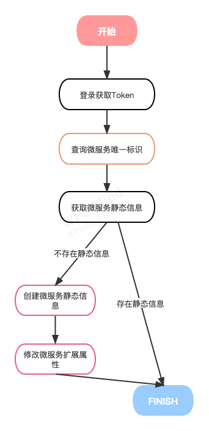
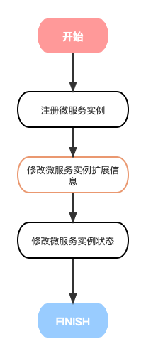
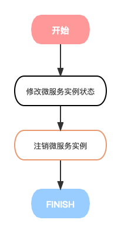
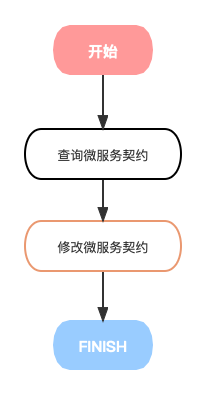
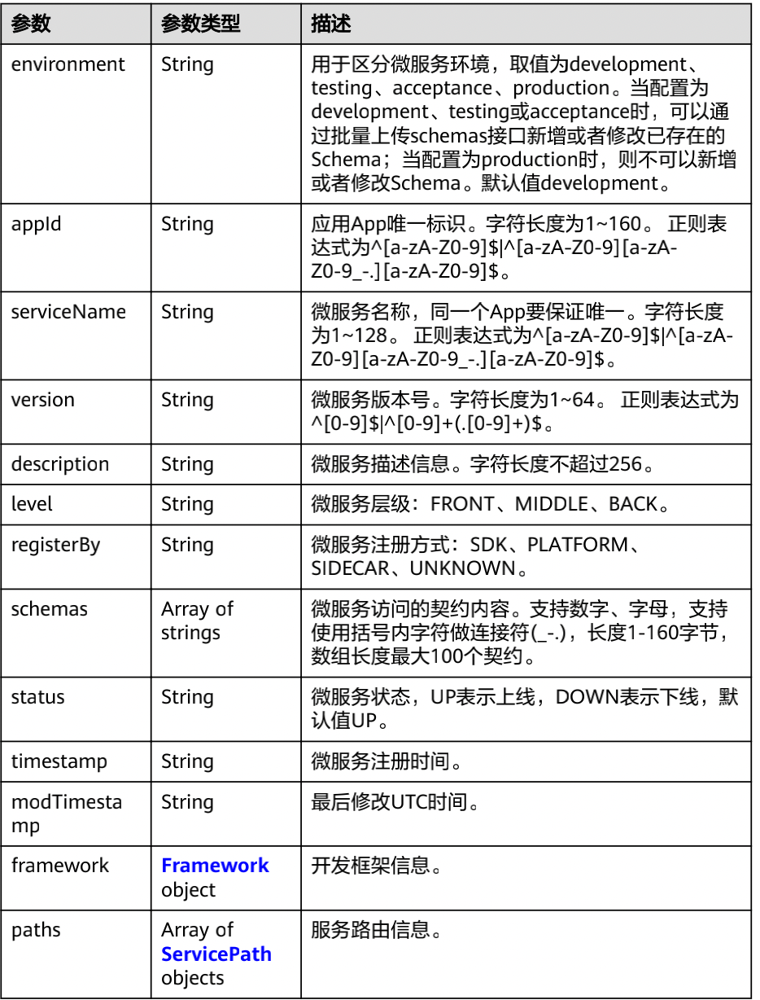
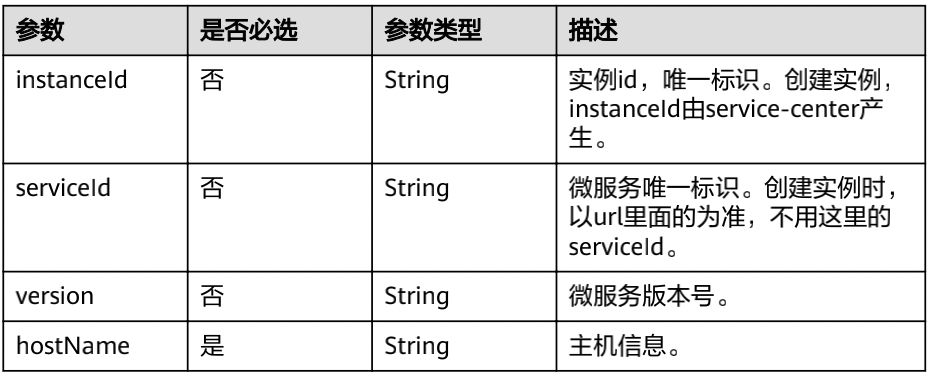
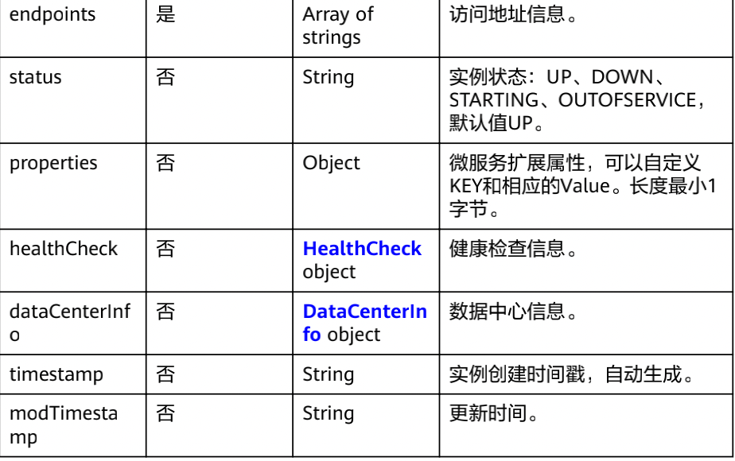

- ## 背景
- 需要分析华为云CSE和DFA-RPC对接的可行性和初步调研结果
- ## 可行性分析
- 1. 目前DFA-RPC的默认协议是bolt协议。而CSE推荐的默认协议是HTTP、dubbo、gRPC等协议。在传输层没有原生对于bolt协议的支持。故直接使用CSE提供的java-chassis提供的能力是无法完成对接的。
  2. 由于DFA-RPC的registry模块使用的是插件式的设计，故理论上只需要添加基于CSE的registry插件，即可完成此部分任务。
- ## 目标
- 1. 开发基于DFA-RPC的基于CSE的registry插件。
  2. 完成DFA-RPC基于CSE的冒烟验证。
  3. 完成DFA-RPC和CSE的属性映射关系。
- ## 任务拆解
- 基于上面的三个目标，我们将任务拆解成以下几个子任务：
- 1. 梳理CSE的API接口清单和元数据结构。(完成)
  2. 硬编码模式完成基于CSE和bolt协议的冒烟验证。(完成)
  3. 梳理DFA-RPC的registry模块的注册机制和方案。(完成)
  4. 梳理bolt传输需要的元数据信息和数据结构。(完成)
  5. 整合基于bolt协议的元数据结构与CSE元数据结构的对接场景。(完成)
  6. 完成CSE的registry模块(DFA-RPC体系)。
  7. 其他待完成任务。
-
- ## 华为CSE对应API梳理
- ### CSE说明
- 微服务引擎（Cloud Service Engine）是用于微服务应用的云中间件，为用户提供注册发现、服务治理、配置管理等高性能和高韧性的企业级云服务能力；CSE可无缝兼容SpringCloud、ServiceComb等开源生态；用户也可结合其他云服务，快速构建云原生微服务体系，实现微服务应用的快速开发和高可用运维。
- 目前我们只有ServiceComb的应用环境。故目前的版本使用ServiceComb进行验证。
- ### 注册中心相关API说明
- CSE提供了REST（Representational State Transfer）风格注册中心API，支持通过HTTPS请求调用，分为以下几块：
	- 鉴权
		- 获取微服务引擎专享版用户Token
	- 微服务
		- 查询指定微服务信息
		- 删除微服务定义信息
		- 查询所有微服务信息
		- 创建微服务静态信息
		- 批量删除微服务静态信息
		- 修改微服扩展属性信息
		- 查询微服务唯一标识信息
	- 契约
		- 查询微服务契约
		- 修改微服务契约
		- 查询微服务的所有契约
	- 微服务实例
		- 注册微服务实例
		- 根据service_id查询微服务实例
		- 注销微服务实例
		- 查询微服务实例详细信息
		- 修改微服务实例扩展信息
		- 修改微服务实例状态
		- 发送心跳信息
		- 按条件查询微服务实例
		- 批量查询微服务实例
	- 依赖关系
		- 查询服务providers
- ### API梳理
- 对于CSE来说注册中心提供的能力为：
- 1. 提供微服务静态信息
  2. 提供微服务实例信息
  3. 注册/注销微服务
  4. 维持微服务状态
  而DFA-RPC的注册中心需要做的事情也是如此。故二者在能力上是可以匹配的。
-
- ## DFA-RPC的registry模块的注册机制
- DFA-RPC的registry模块的注册机制参看： https://help.aliyun.com/document_detail/149925.html
- 对应的方法如下：
- public abstract boolean start();  //启动客户端 
  public abstract void register(ProviderConfig config);  //注册服务
  public abstract void unRegister(ProviderConfig config);  //取消注册，优雅关闭使用
  public abstract void batchUnRegister(List<ProviderConfig> configs); //批量取消注册
  public abstract List<ProviderGroup> subscribe(ConsumerConfig config); //订阅服务
  public abstract void unSubscribe(ConsumerConfig config); //取消订阅，优雅关闭使用
  public abstract void batchUnSubscribe(List<ConsumerConfig> configs); //批量取消订阅
-
- ## DFA-RPC对接CSE的接入点梳理
- 基于上面的分析，我们可知需要在DFA-RCP的registry的各方法中织入以下的方法来完成与CSE的对接。
- ### 启动客户端
- registry的方法名：start
- CSE需要调用的接口按顺序分别为：
- 1. 获取微服务引擎专享版用户Token
  2. 查询微服务唯一标识信息
  3. 查询指定微服务信息
  4. 创建微服务静态信息
  5. 修改微服务扩展属性信息
  
-
- ### 注册服务
- registry的方法名：register(ProviderConfig config)
- CSE需要调用的接口按顺序分别为：
- 1. 注册微服务实例
  2. 修改微服务实例扩展信息
  3. 修改微服务实例状态
  
-
- ### 取消注册
- registry的方法名：unRegister(ProviderConfig config)
- CSE需要调用的接口为：
- 1. 修改微服务实例状态
  2. 注销微服务实例
  
- ### 批量取消注册
- registry的方法名：batchUnRegister(List<ProviderConfig> configs)
- CSE需要调用的接口与取消注册方法一致。
- ### 订阅服务
- registry的方法名：subscribe(ConsumerConfig config)
- CSE需要调用的接口为：
- 1. 查询指定微服务契约信息
  2. 修改微服务契约(添加此consumer信息)
- 
- ### 取消订阅服务
- registry的方法名：unSubscribe(ConsumerConfig config)
- CSE需要调用的接口为：
- 1. 查询指定微服务契约信息
  2. 修改微服务契约(删除此consumer信息)
- 
- ### 批量取消订阅服务
- registry的方法名：batchUnSubscribe(List<ConsumerConfig> configs)
- CSE执行的方法与取消订阅服务的方法一致。
-
- ## bolt协议元数据数据结构定义
- bolt协议传输需要以下元数据：
- com.shine.dfa.sample.service.runtime.UserBService:1.0@DEFAULT	bolt://192.168.31.133:12203?serialization=hessian2
- providerGroup的数据结构如下：
- |字段名|字段类型|字段说明|参考值|
  |--|--|--|--|
  |groupName|string|组名称|com.shine.dfa.sample.service.runtime.UserBService:1.0@DEFAULT|
  |providerInfos| array|注册信息列表 | 参看providerInfo数据结构|
-
- providerInfo的数据结构如下：
- |字段名|字段类型|字段说明|参考值|
  |--|--|--|--|
  |port|integer|端口号|12200|
  |weight|double|权重|1.0|
  |serializationType|string|序列化类型|hessian2|
  |protocolType|string|协议|bolt|
  |path|string|url路径|10.168.1.235|
  |staticAttrs|string|其他静态属性|默认为空|
- ## CSE数据结构定义
- CSE数据结构如下：
- mircoService部分：
- 
- mircoServiceInstance部分：
- 
- 
-
- ## bolt协议对接CSE数据结构
- ### providerGroup部分
- |bolt字段名|CSE字段名|是否需要转换|说明|
  |--|--|--|--|
  |appName|appId|否|
  |groupName|serviceName|是|groupName中的service全路径部分|
  |groupName|version|是|groupName中的version部分|
- ### providerInfo部分
- |bolt字段名|CSE字段名|是否需要转换|说明|
  |--|--|--|--|
  |port|properties|否|properties的属性之一|
  |weight|properties|否|properties的属性之一|
  |serializationType|properties|否|properties的属性之一|
  |protocolType|properties|否|properties的属性之一|
  |path|hostName|是|path的host部分|
  |path|endpoints|是|path的endpoint部分，只有一个|
  |staticAttrs|properties|否|properties的属性|
- ## 后续任务
- 1. 基于上述文档完成实际注册组件开发(非冒烟注册)。
  2. 开发过程中若发现新问题需要对此文档进行调整。
## 已知后续问题
- ### 服务心跳保持
- 1. 服务心跳保持目前未设计。需要按照DFA-RPC对接的模式进行设计，
- ### 使用注册中心主动推的模式还是客户端拉的模式同步数据