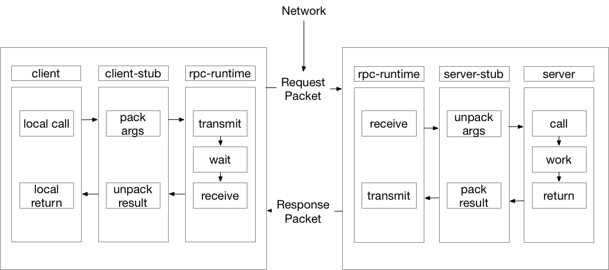
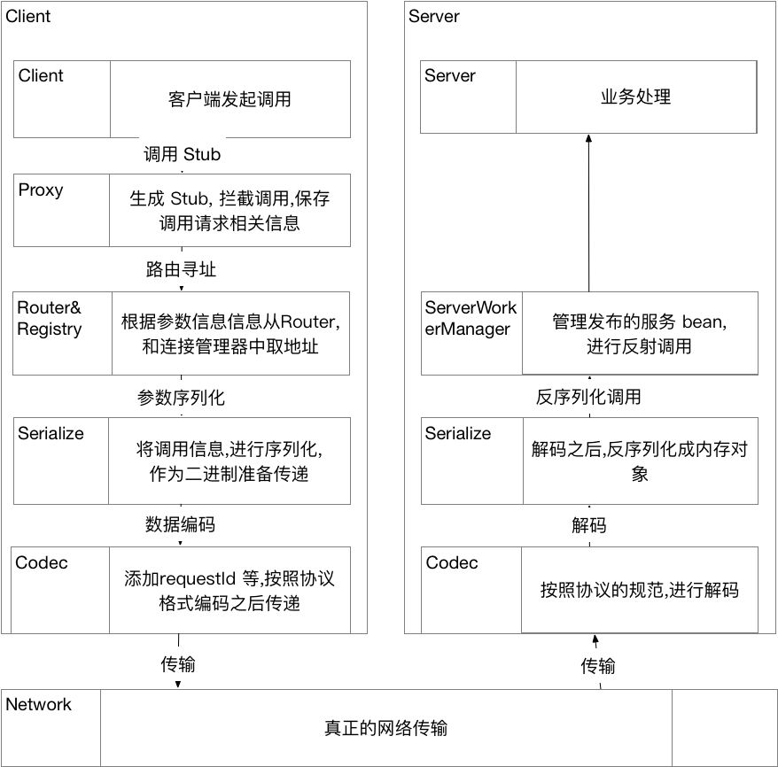
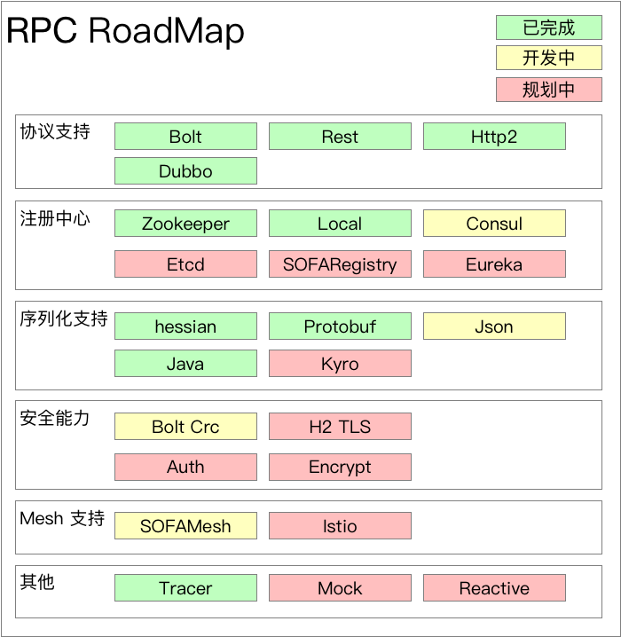
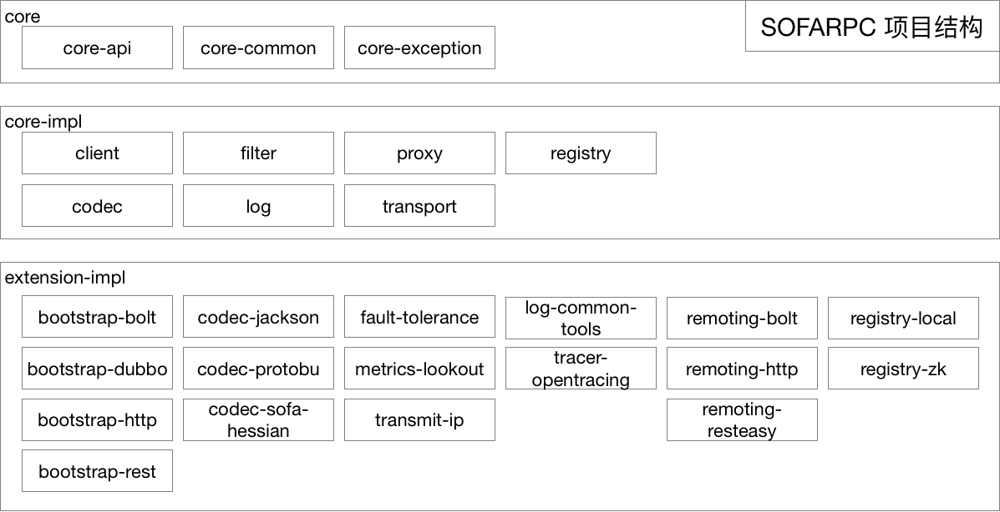
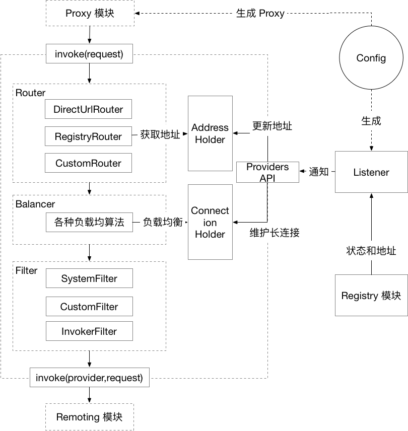
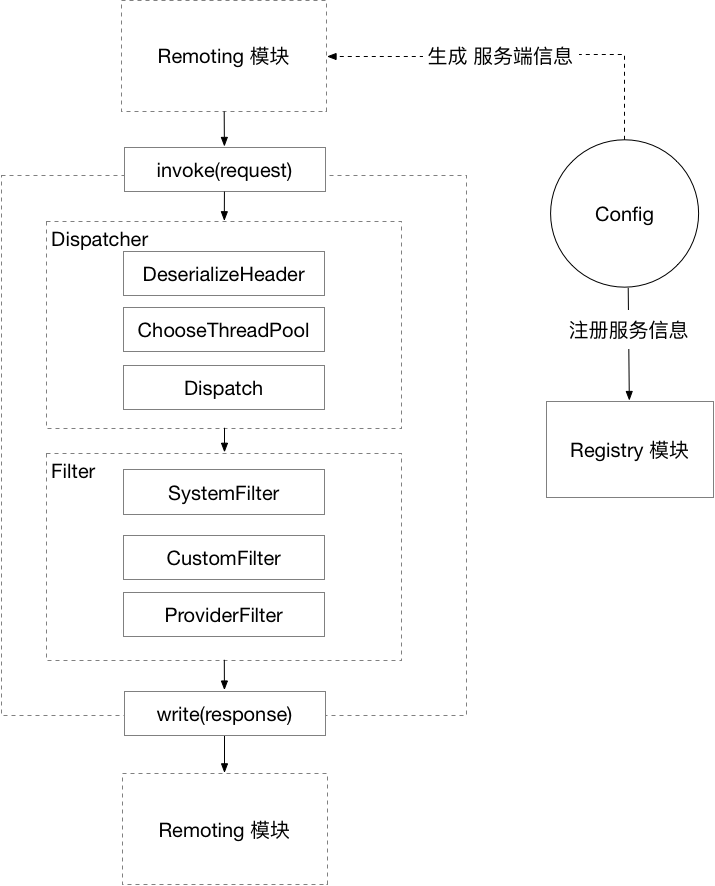
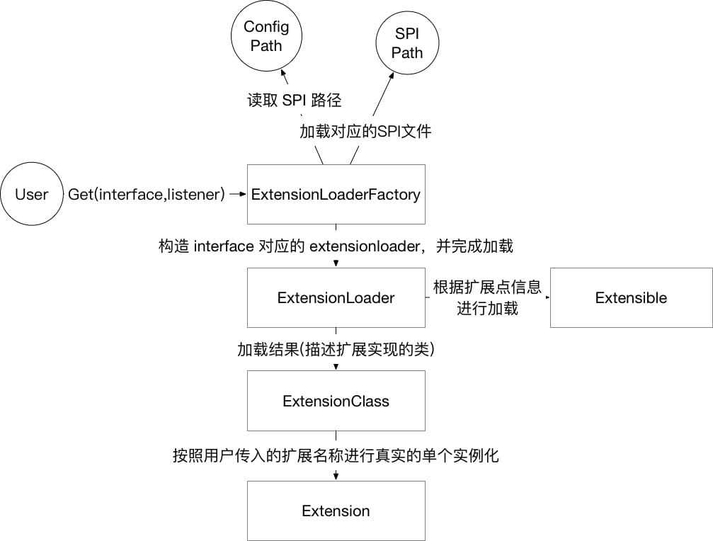
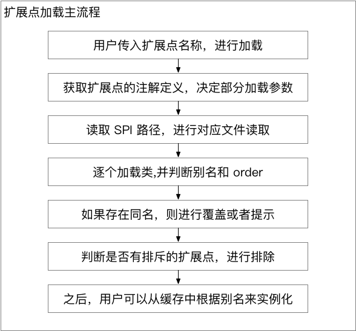

- # 前言
- RPC 框架作为分布式技术的基石，在分布式和微服务环境下，扮演着非常重要的角色。
  在蚂蚁金服的分布式技术体系下，我们大量的技术产品（非网关类产品），都需要在内网，进行节点间通信。底层通信框架，已经在蚂蚁自研的 BOLT中的进行了实践，BOLT 提供了优秀的通信协议与通信框架，在 BOLT 的基础上，我们研发了自己的 RPC 框架，提供了负载均衡，流量转发，链路追踪，链路数据透传，故障剔除等基础能力，本文将从以下几个方面介绍目前已经开源的 SOFARPC 框架。
- 1. RPC 是什么
  2.  通用 RPC 框架原理
  3.SOFARPC 框架设计
- ## RPC是什么
- RPC 这个概念术语在上世纪 80 年代由 Bruce Jay Nelson 提出，在 Nelson 的论文 “Implementing Remote Procedure Calls” 中他提到了几点：
- 1. 简单：RPC 概念的语义清晰,简单，方便建立分布式计算。
  2. 高效：在使用方看来,十分简单而且高效。
  3. 通用：通用,适用于各种不同的远程通信调用。
-
- 这里面Nelson提出了一个 RPC框架应该包含的几个部分。
- 1. User
  2. User-stub
  3. RPC-Runtime
  4. Server-stub
  5. Server
- 如下图示，为了和现在我们通用的术语一致，我将 User 改成 Client 了。
- 
-
- 当 Client 想发起一个远程调用时，实际是通过本地调用 Client-stub，而 Client-stub 负责将调用的接口、方法和参数通过约定的协议规范进行编码并通过本地的 RPC-Runtime 实例传输到远端的实例。远端 RPC-Runtime 实例收到请求后交给 Server-stub 进行解码后发起本地端调用，在 Java中可以认为就是反射调用,调用结果再返回给 Client 端。
- 从上文可以看到，一个典型的 RPC 调用过程还是相对简单的。但是实际上，一个真正的 RPC 框架要做的远不止这些。
- ## 通用 RPC 框架原理
- 相信对 RPC 框架有过一定了解，或者使用过 RPC 产品的同学，在看到了图上之后，会产生几个疑问
- 1. Stub 怎么出现？
  2. 怎么打包参数？
  3. 怎么传输?
  4. 怎么知道目标地址?
  5. 怎么发布一个 RPC 服务?
- 在解释这些问题之前，这里我画了一张目前通用的 RPC 框架的一个流程图：
- 
- 其中：
- 1. 创建代理解决了 Stub 的问题。
  2. 序列化和网络协议编码解决了打包的问题。
  3. 服务发现与路由寻址解决了如何知道目标地址的问题。
  4. 如何发布一个服务，Registry 来解决。
  5. Bolt，Netty 等解决了网络传输的问题。
-
- 当然 SOFARPC 的功能不止这些,在解决了这些问题之后，根据业务的需求和实际的线上情况，我们也开发了熔断,限流,故障剔除,数据透传等能力，下面我会来介绍 SOFARPC 的框架设计。
- ## SOFARPC框架设计
- ### SOFARPC RoadMap
- 首先介绍下目前 SOFARPC 的现状和一些正在做的事情。
- 
- ## SOFARPC 结构设计
- 原理大家清楚之后，为了方便大家尽快上手开发使用，我先从目前的 RPC 框架结构来简单介绍。
- 
- 其中 core和 core-impl 是核心的功能，包含 API 和一些扩展机制，extension-impl 中，则包含了不同的实现和扩展，比如对 http，rest，对 metrics，以及其他注册中心的集成和扩展。
- 如 bootstrap 中对协议的支持，remoting 中对网络传输的支持，registry 中对注册中心的支持等。
- 在此基础上，由于 RPC 框架涉及服务端和客户端，我会结合 SOFARPC 的处理流程，详细介绍下客户端和服务端的处理。
- 
- 当使用方对服务进行了引用配置之后：
- 1. RPC 生成 Proxy，作为用户可以操作的入口。
  2. 向服务中心订阅这个 RPC 的地址信息。
  3. 使用方发起调用，经过路由，负载均衡，各类 Filter 发起调用。
- ### 服务端处理流程
- 
- 在服务端看来,通过 TCP 监听端口后：
- 1. 接到 RPC 请求后，进行解码和反序列化。
  2. 选择线程池，进行分发。
  3. 经过 Filter，进行反射调用。
  4. 将结果序列化，编码,进行写回。
- ### 可扩展的机制
- 从上面的流程中，可以看到，每个部分基本都有多种实现可选，这得益于RPC的扩展机制。
- 为了对 RPC 各个环节的都有充足的可扩展性，提供 SPI 的能力，所以内部的实现和第三方实现都是绝对平等的。
- 相比原生 SPI，我们实现了更强大的功能：
- 1. 按需加载
  2. 可以有别名
  3. 可以有优先级进行排序和覆盖
  4. 可以控制是否单例
  5. 可以在某些场景下使用编码
  6. 可以指定扩展配置位置
  7. 可以排斥其他扩展点
- 我们实现了一套自己的 SPI 机制。整个流程如下：
- 
- 在启动加载阶段，RPC 会根据对应的配置，加载需要调用方法ExtensionLoader(Class<T> interfaceClass, ExtensionLoaderListener<T> listener) 逻辑如下：
- 1. 首先读取rpc-config-default.json和rpc-config.json，找到扩展描述文件存放的文件夹：extension.load.path属性。
  2.  找到接口类对应的扩展描述文件的文件名（默认就是接口名，也可以自己指定）。
  3. 循环加载这个文件下的扩展描述文件，按行读取。（同一个接口的同一个别名对应唯一的一个实现类，可以重复，允许覆盖。
  4. 保存扩展实现类的alias和实现类的对应关系。
  5.  如果 ExtensionLoaderListener 不为空，则通知 Listener。
- 最终，将会构造出各个不同的 Filter，Invoker 等等。
- 其中我们首先设计了一个扩展，代表这个类或者接口是可扩展的，默认单例、不需要编码。
-
- ```java  
  @Documented
  @Retention(RetentionPolicy.RUNTIME)
  @Target({ ElementType.TYPE })
  public @interface Extensible {
  
      /**
       * 指定自定义扩展文件名称，默认就是全类名
       *
       * @return 自定义扩展文件名称
       */
      String file() default "";
  
      /**
       * 扩展类是否使用单例，默认使用
       *
       * @return 是否使用单例
       */
      boolean singleton() default true;
  
      /**
       * 扩展类是否需要编码，默认不需要
       *
       * @return 是否需要编码
       */
      boolean coded() default false;
  }  
  ```
- 同时，针对具体的扩展实现，定义一个扩展注解
-
- ```java  
  @Documented
  @Retention(RetentionPolicy.RUNTIME)
  @Target({ ElementType.TYPE })
  public @interface Extension {
      /**
       * 扩展点名字
       *
       * @return 扩展点名字
       */
      String value();
  
      /**
       * 扩展点编码，默认不需要，当接口需要编码的时候需要
       *
       * @return 扩展点编码
       * @see Extensible#coded()
       */
      byte code() default -1;
  
      /**
       * 优先级排序，默认不需要，大的优先级高
       *
       * @return 排序
       */
      int order() default 0;
  
      /**
       * 是否覆盖其它低{@link #order()}的同名扩展
       *
       * @return 是否覆盖其它低排序的同名扩展
       * @since 5.2.0
       */
      boolean override() default false;
  
      /**
       * 排斥其它扩展，可以排斥掉其它低{@link #order()}的扩展
       *
       * @return 排斥其它扩展
       * @since 5.2.0
       */
      String[] rejection() default {};
  }
  ```
- 通过核心类 ExtensionLoader 的加载过程。完成对扩展的加载：
- 
- 当我们或者其他使用者想要实现一个自己的扩展点的时候，只需要按照如下的步骤即可开始。
- 指定扩展点
  
- 指定扩展实现类
- 
- 扩展描述文件 META-INF/services/sofa-rpc/com.aliapy.sofa.rpc.client.Client
  
- 当这些准备完成后，直接调用即可。
- 
- 基于这套扩展加载机制，我们可以实现自定义扩展点，实现 SOFARPC 内部及第三方的自由扩展。
- ## 总结
- 本文作为 SOFARPC 框架第一篇，主要还是希望大家对 RPC 框架有一个认识和了解，之后，我们会逐步详细介绍每部分的代码设计和实现，预计会按照如下的目录进行：
- 1. SOFARPC 同步异步实现剖析
  2. SOFARPC 线程模型剖析
  3. [[SOFARPC 连接管理与心跳剖析]] 
  4. SOFARPC 单机故障剔除剖析
  5. SOFARPC 路由实现剖析
  6. SOFARPC 序列化比较
  7. SOFARPC 注解支持剖析
  8. SOFARPC 优雅关闭剖析
  9. [[SOFARPC 链路追踪剖析]] 
  11. SOFARPC 数据透传剖析
  12. SOFARPC 跨语言支持剖析
  13. SOFARPC 泛化调用实现剖析