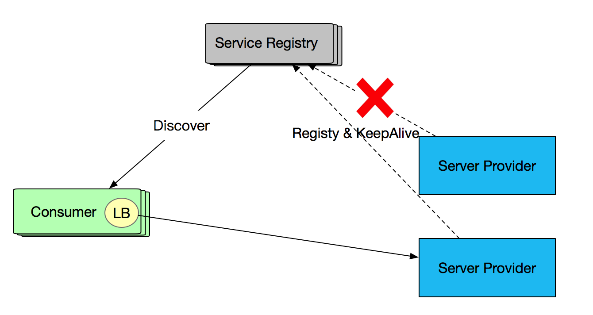

- ## 一. 前言
- 对于金融业务而言每个环节都涉及到大量的资金操作，若因为网络、硬件等原因导致系统不稳定性，不仅影响用户体验，更重要的是可能会引起资损问题，因此系统可用性至关重要。在微服务分布式架构中提高系统可用性的常见方案是 集群（冗余）。 集群方式将一个服务部署在多个机器上，通过硬负载或软负载实现服务的均衡负载，虽然可以有效避免单点问题，但是仍然避免不了某些场景单机故障引起服务调用失败的问题。
- SOFARPC 提供了自动单机故障剔除能力，能够自动监控 RPC 调用的情况，对故障节点进行权重降级，并在节点恢复健康时进行权重恢复，提高系统可用性。本文将从以下几个方面进行剖析：
- 1. 单机故障和服务降级介绍
  2. SOFARPC 单机故障剔除原理
- ## 二. 单机故障和服务降级
- 在分布式架构中常见可用性方案的是 集群（冗余），即将一个服务部署在多个机器上，通过硬负载或软负载实现服务的均衡负载。硬件负载因每次请求都需要经过硬件负载，承担所有的访问压力，当集群规模增加、流量增多，硬件负载可能因无法支撑所有流量而导致系统不可用。
- 
- 软负载则提供注册中心，并将负载能力转移到服务调用方( Consumer )，注册中心只有在 Consumer 首次订阅或服务发生变化时才会发生交互，避免了并发访问下的单点问题。下图是基于软负载的服务调用：
- 
- 虽然软负载可以避免单点问题，但可能存在以下场景导致服务不可用：
- 1. Provider 出现单点故障或宕机，与 Consumer 的长连接已断开，但注册中心尚未摘除或未及时通知Consumer。
  2. Consumer 和 Provider的长连接还在，注册中心未下发摘除，但服务器端由于某些原因，例如长时间的 Full GC, 硬件故障（后文中为避免重复，统一描述为机器假死）等场景，处于假死状态。
- 这两种场景都是服务端出现故障，但由于长连接还保留等原因注册中心未摘除服务，导致服务调用失败。针对第一种情况 Consumer 不应调用出现故障的 Provider，否则会引起部分服务不可用；针对第二种情况，这个 Consumer 应该不调用或少调用该 Provider，可以通过权重的方式来进行控制。目前 SOFARPC 5.3.0 以上的版本支持 RPC 单机故障剔除能力。SOFARPC 通过服务权重控制方式来减少异常服务的调用，将更多流量打到正常服务机器上，提高服务可用性。
- ### 2.1 SOFARPC故障剔除 vs 注册中心故障剔除
- SOFARPC 的故障剔除与注册中心故障服务剔除不同，它们从不同的维度来完成故障剔除提高服务可用性。主要两方面的区别：
- 1. 故障剔除的时机
  2. 故障剔除的细粒度
- #### 故障剔除的时机
- SOFARPC 的故障剔除与注册中心故障服务剔除不同，它们从不同的维度来完成故障剔除提高服务可用性。注册中心服务管理关注 Provider 与注册中心的心跳或长连接。如果 Provider 出现心跳异常或长连接不存在，则及时将服务从注册中心剔除，并告知 Consumer 移除本地缓存的故障 Provider 信息。Comsumer 在负载均衡选择时则不考虑被剔除的 Provider，如图所示
- 
- 而 SOFARPC 单机故障剔除针对的场景不同，针对的是注册中心还未剔除的服务，这些服务与 Consumer 仍然保持长连接，但由于机器假死，不能提供正常服务。 如下图所示：
- 
- ####  故障剔除的细粒度
-