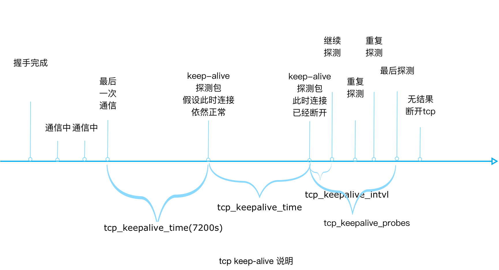
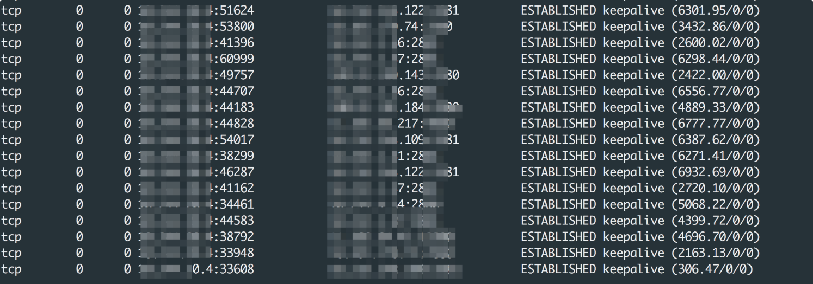

- ## 前言
- 在 RPC 调用过程中，我们经常会和多个服务端进行远程调用，如果在每次调用的时候，都进行 TCP 连接，会对 RPC 的性能有比较大的影响，因此，实际的场景中，我们经常要对连接进行管理和保持。
- SOFARPC 应用心跳包以及断线重连实现,结合系统 tcp-keepalive 机制，来实现对 RPC 连接的管理和保持。
- ## 连接管理
- 首先我们将会介绍连接管理相关的一些背景知识。
- ### 长连接和短连接
- 短连接，一般是指客户端向服务端发起连接请求。连接建立后，发送数据，接收服务端数据返回，然后触发连接断开，下次再重新重复以上过程。
- 长连接，则是在建立连接后，发送数据，接收数据，但是不主动断开，并且主动通过心跳等机制来维持这个连接可用，当再次有数据发送请求时，不需要进行建立连接的过程。
- 一般的，长连接多用于数据发送频繁，点对点的通讯，因为每个 TCP 连接都需要进行握手，这是需要时间的，在一些跨城，或者长距离的情况下，如果每个操作都是先连接，再发送数据的话，那么业务处理速度会降低很多，所以每个操作完后都不断开，再次处理时直接发送数据包即可，节省再次建立连接的过程。
- 但是，客户端不主动断开，并不是说连接就不会断。因为系统设置原因，网络原因，网络设备防火墙，都可能导致连接断开。因此我们需要实现对长连接的管理。
- ### TCP 层 keep-alive
- #### tcp 的 keep-alive 是什么
- tcp-keepalive，顾名思义，它可以尽量让 TCP 连接“活着”，或者让一些对方无响应的 TCP 连接断开，
- 使用场景主要是：
- 1. 一些特定环境，比如两个机器之间有防火墙，防火墙能维持的连接有限，可能会自动断开长期无活动的 TCP 连接。
  2. 还有就是客户端，断电重启，卡死等等，都会导致 TCP 连接无法释放。
- 这会导致：
- 一旦有热数据需要传递，若此时连接已经被中介设备断开，应用程序没有及时感知的话，那么就会导致在一个无效的数据链路层面发送业务数据，结果就是发送失败。
- 无论是因为客户端意外断电、死机、崩溃、重启，还是中间路由网络无故断开、NAT 超时等，服务器端要做到快速感知失败，减少无效链接操作。
- 而 tcp-keepalive 机制可以在连接无活动一段时间后，发送一个空 ack，使 TCP 连接不会被防火墙关闭。
- #### 默认值
- tcp-keepalive，操作系统内核支持，但是不默认开启,应用需要自行开启，开启之后有三个参数会生效，来决定一个 keepalive 的行为。
- ```java
  net.ipv4.tcp_keepalive_time = 7200
  net.ipv4.tcp_keepalive_probes = 9
  net.ipv4.tcp_keepalive_intvl = 75
  ```
- 可以通过如下命令查看系统 tcp-keepalive 参数配置。
- ```java
  sysctl -a | grep keepalive
  cat /proc/sys/net/ipv4/tcp_keepalive_time
  sysctl net.ipv4.tcp_keepalive_time
  ```
- 系统默认值可以通过这个查看。
- tcp_keepalive_time，在 TCP 保活打开的情况下，最后一次数据交换到 TCP 发送第一个保活探测包的间隔，即允许的持续空闲时长，或者说每次正常发送心跳的周期，默认值为 7200s（2h）。 tcp_keepalive_probes 在 tcp_keepalive_time 之后，没有接收到对方确认，继续发送保活探测包次数，默认值为 9（次）。 tcp_keepalive_intvl，在 tcp_keepalive_time 之后，没有接收到对方确认，继续发送保活探测包的发送频率，默认值为 75s。
- 这个不够直观，直接看下面这个图的说明：
- 
- ### 如何使用
- 应用层，以 Java 的 Netty 为例，服务端和客户端设置即可。
- ```java 
  ServerBootstrap b = new ServerBootstrap();
              b.group(bossGroup, workerGroup)
               .channel(NioServerSocketChannel.class)
               .option(ChannelOption.SO_BACKLOG, 100)
               .childOption(ChannelOption.SO_KEEPALIVE, true)
               .handler(new LoggingHandler(LogLevel.INFO))
               .childHandler(new ChannelInitializer<SocketChannel>() {
                   @Override
                   public void initChannel(SocketChannel ch) throws Exception {
                       ch.pipeline().addLast(
                               new EchoServerHandler());
                   }
               });
  
              // Start the server.
              ChannelFuture f = b.bind(port).sync();
  
              // Wait until the server socket is closed.
              f.channel().closeFuture().sync();
  ```
- 就是这里面的ChannelOption.SO_KEEPALIVE, true 对应即可打开.
- 目前 bolt 中也是默认打开的.
- > .childOption(ChannelOption.SO_KEEPALIVE,
                  Boolean.parseBoolean(System.getProperty(Configs.TCP_SO_KEEPALIVE, "true")));
- Java 程序只能做到设置 SO_KEEPALIVE 选项，至于 TCP_KEEPCNT，TCP_KEEPIDLE，TCP_KEEPINTVL 等参数配置，只能依赖于 sysctl 配置，系统进行读取。
- ### 检查
- 查看 tcp 连接 tcp_keepalive 状态
- > 我们可以用 netstat -no|grep keepalive 命令来查看当前哪些 tcp 连接开启了 tcp keepalive.
- 
- ### 应用层 keep-alive
- 应用层 keep-alive 方案，一般叫做心跳包，跟 tcp-keepalive 类似，心跳包就是用来及时监测是否断线的一种机制，通过每间隔一定时间发送心跳数据，来检测对方是否连接，是属于应用程序协议的一部分。
- #### 心跳是什么
- 心跳想要实现的和 tcp keep-alive 是一样的。
- 由于连接丢失时，TCP 不会立即通知应用程序。比如说，客户端程序断线了，服务端的 TCP 连接不会检测到断线，而是一直处于连接状态。这就带来了很大的麻烦，明明客户端已经断了，服务端还维护着客户端的连接，比如游戏的场景下，用户客户端都关机了，但是连接没有正常关闭，服务端无法知晓,还照常执行着该玩家的游戏逻辑。
- 听上去和 tcp keep-alive 类似，那为什么要有应用层心跳?
- 原因主要是默认的 tcp keep-alive 超时时间太长默认是 7200 秒，也就是 2 个小时。并且是系统级别，一旦更改，影响所有服务器上开启 keep alive 选项的应用行为。另外，socks proxy 会让 tcp keep-alive 失效， socks 协议只管转发 TCP 层具体的数据包，而不会转发 TCP 协议内的实现细节的包（也做不到）。
- 所以，一个应用如果使用了 socks 代理，那么 tcp keep-alive 机制就失效了，所以应用要自己有心跳包。
- socks proxy 只是一个例子，真实的网络很复杂，可能会有各种原因让 tcp keep-alive 失效。
- ### 如何使用
- 基于 netty 开发的话，还是很简单的。这里不多做介绍，因为后面说到 rpc 中的连接管理的时候，会介绍。
- #### 应用层心跳还是 Keep-Alive
- 默认情况下使用 keepalive 周期为2个小时，
- #### 系统 keep-alive 优势：
- 1. TCP协议层面保活探测机制，系统内核完全替上层应用自动给做好了。 
  2. 内核层面计时器相比上层应用，更为高效。 3.上层应用只需要处理数据收发、连接异常通知即可。 4.数据包将更为紧凑。