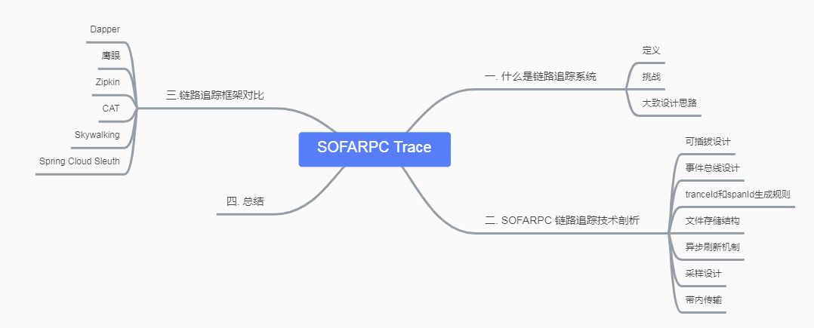
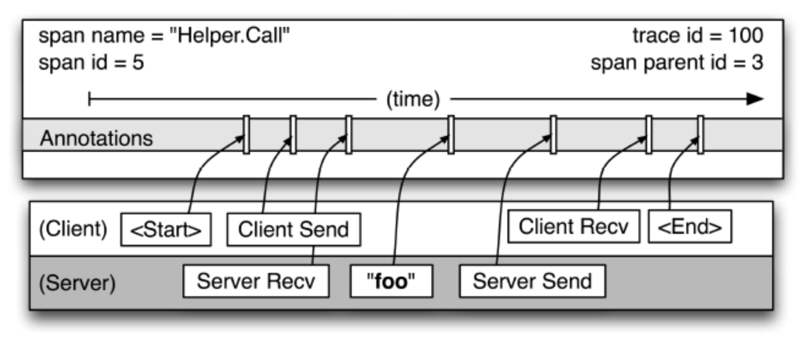
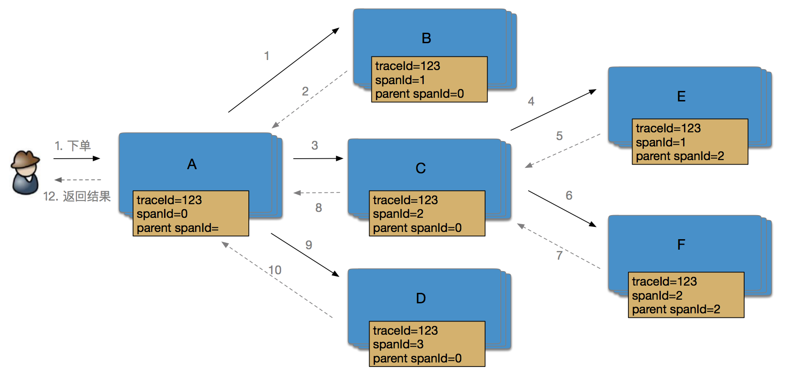
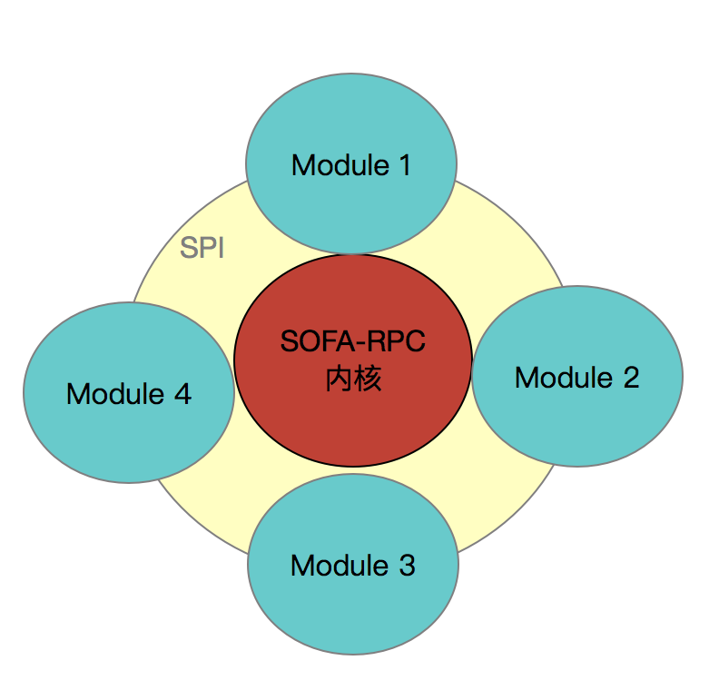
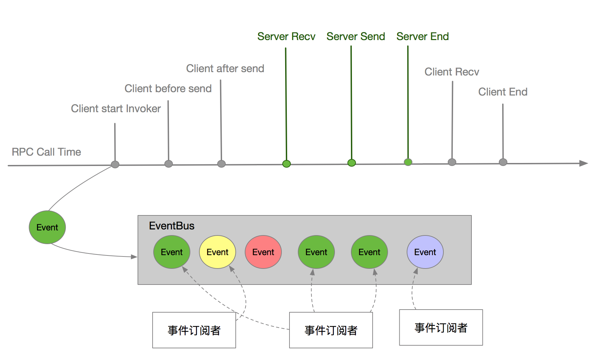

- # SOFARPC 链路追踪剖析
- ## 一. 前言
- 微服务已经被广泛应用在工业界，微服务带来易于团队并行开发、独立部署、模块化管理等诸多优点。然而微服务将原单体拆分多个模块独立部署，各模块之间链接变得错综复杂，在大规模分布式系统中这种复杂链路给维护带来了诸多困难。 如果对整个微服务架构不能了然于胸，便很难理清各模块之间的调用关系。 例如修改一个服务接口，对哪些服务造成影响不能快速定位。
- SOFARPC 在5.4.0 以后提供了链路追踪技术，可以有效协助开发运营人员进行故障诊断、容量预估、性能瓶颈定位以及调用链路梳理。
- 如思维导图所示，本文将从以下几个方面介绍目前已经开源的 SOFARPC 的链路追踪技术：
- 
- ## 二. 什么是链路追踪技术
- 链路追踪技术主要是收集、存储、分析分布式系统中的调用事件数据，协助开发运营人员进行故障诊断、容量预估、性能瓶颈定位以及调用链路梳理。 链路追踪技术包含了数据埋点、收集、存储、分析等相关技术，是一套技术体系。 大部分的链路追踪框架都是参考 google链路追踪系统Dapper 的一篇设计论文（《Dapper, a Large-Scale Distributed Systems Tracing Infrastructure》 ），SOFARPC 的SOFATracer 的设计灵感也是来自这篇著名论文。
- 以大规模分布式电商系统为例，用户下单购买某款产品时后端需要调用各系统或子模块进行协作，共同完成一个用户请求。 如下图所示，用户的下单行为涉及到了A、B、C、D、E、F 6个系统的协同工作，这些系统都是以集群形式部署。整个链路中最长的链路调用是3层，如 A-> C -> E 或 A -> C -> F。
- 
- 模块的增多加大了系统出错的概率，一旦因某系统/模块出错导致整个请求调用出错，在缺乏链路追踪的条件下很难定位具体出错的模块，只能通过日志搜索定位。 在实际生产环境下比较关注一个请求中的各个模块的耗时情况、连续调用情况、出错的节点等信息。
- 为了解决上述问题，Dapper提供了一套解决方案。整个方案分为数据收集、存储和分析几个部分。分布式追踪技术会记录一个请求中各模块的调用信息；并通过一个处理集群把所有机器上的日志增量地收集到集群当中进行处理，将同一个请求的日志串联；最后可视化显示调用情况。
- 常用的数据收集方式为埋点，通过在公共组件如RPC等注入代码，收集服务调用的相关信息。目前大部分链路调用系统如Dapper、鹰眼、Spring Cloud Sleuth 都在用这种模式。同样SOFARPC 作为一个公共的通讯框架，在金融业务领域被广泛应用，因此适合作为埋点，这样无需业务端自行埋点，可做到对业务代码的无侵入性。
- Dapper 将一个调用过程构建成一棵调用树(称为Tracer)，Tracer树中的每个节点表示链路调用中的一个模块或系统。 通过一个全局唯一的 traceId 来标识一个请求调用链。 并定义了span，span表示一个系统的调用，一个span 包含以下阶段：
-
- * Start:  发起调用
  * cleint send(cs): 客户端发送请求
  * Server Recv(sr)：服务端收到请求
  * Server Send(ss): 服务端发送响应
  * Client Recv(cr) : 客户端收到服务端响应
  * End： 整个链路完成
- 
- 每个span 包含两个重要的信息 span id(当前模块的span id) 和 span parent ID(上一个调用模块的span id)，通过这两个信息可以定位一个span 在调用链的位置。 通过以上信息我们可以定义用户下单过程的调用链：
- 
- SOFARPC中的链路追踪技术主要是作为埋点部分，因此对于链路追踪系统的收集和分析部分本文不做详述，想要深入了解的可参看参考资料内容。链路追踪可以提供我们以下功能:
-
- 1. **服务耗时、瓶颈分析** ：分析每个服务的耗时情况，可以针对耗时长的服务进行优化，提高服务性能。
  2. **可视化错误**：快速定位服务链路中出错的环境，便于排查和定位问题。一般链路追踪中间件都提供了ZipKin 页面支持。
  3. **链路优化**: 对于调用比较频繁的服务，可以针对这些服务实施一些优化措施。
  4. **调用链路梳理**：通过可视化界面，对整个调用链路有个清晰的认识。
- 在设计分布式链路框架时需要考虑一下几个问题：
- 1. **低损耗、高性能**: 追踪系统对在线服务的影响应该做到足够小，不影响线上服务性能。
  2. **应用透明**: 对于业务开发人员来说，应不需要知道有跟踪系统这回事的。
  3. **可扩展性**：虽则业务规则增大、集群增多，监控系统都应该能完全把控住这种快速变化。
  4. **数据采样设计**：如果每条日志都记录，在高并发情况下对系统有一定的损耗。但收集数据太少可能对统计结果有所影响，所以应合理设计采样比例。
- ## 三. SOFARPC 链路追踪设计原理
- SOFARPC 作为一个基础的通讯中间件，对服务调用有很强的感知能力，容易获取链路追踪所需的服务调用信息。因此很多链路追踪系统都会选择RPC 作为埋点对象，通过对RPC中间件的埋点可以轻松做到对用户的无感知、透明化。 SOFARPC在5.4.0 以后开始支持分布式链路追踪，其技术实现主要依赖于所集成的SOFATracer。
- SOFARPC 不仅提供了埋点信息采集的能力, 还支持数据上报zipkin。 通过SOFARPC + SOFATracer + zipKin 可以快速搭建一套完整的链路追踪系统，包括埋点、收集、分析展示等。 收集和分析主要是借用zipKin的能力，本文重点讲SOFARPC中的数据埋点设计。SOFARPC自身具备的微内核设计和可拓展性，使得在SOFARPC在不破坏开放封闭原则的前提下，比较轻松地集合SOFATracer。该部分主要从以下几个方面讨论SOFARPC的链路追踪设计思路：
- 1. 可插拔设计。 SOFARPC采用了微内核设计，使得很容易扩展，增加新功能。
  2. 总线设计。为数据埋点做提供一种无侵入的扩展方式。
  3. 调用trace和span
  4. 数据采样设计
  5. 异步刷新机制
  6. 耗时计算：链路调用的耗时统计等信息获取。
  7. 埋点数据透传，各模块之间的链路调用数据的透传机制。
  8. 异步线程的链路调用。在异步多线程环境下如何保证traceId和spanId的有序性。
  9. 链路调用日志数据的文件存储结构
- ### 3.1 可插拔设计
- SOFARPC自身具备的微内核设计和可拓展性，使得在SOFARPC在不破坏开放封闭原则的前提下，比较轻松地集合SOFATracer。SOFARPC 采用了自己实现的一套SPI机制， 通过该SPI机制动态去加载其他模块、过滤器、协议等，实现灵活拓展。SOFARPC 为了集成SOFATracer也采用了这套机制，做到可插拔。
- 
- SofaTracerModule 类实现了Module 接口，并增加 @Extension(“sofaTracer”) 注解，方便SOFARPC在启动时将相关模块加载进来。 SofaTracerModule 作为SOFA-PRC 链路追踪的入口，在SofaTracerModule模块被加载时完成一些事件的订阅。
- 这里会订阅 9 种事件， 通过监听SOFARPC的这 9 种事件，来完成埋点数据的获取和异步磁盘写入操作。SOFARPC通过事件总线设计来订阅这些事件，当事件发生时通知对应的订阅者做相应的操作。
- ### 3.2 事件总线设计
- 事件总线(EventBus)设计也是 SOFARPC的一个具有很强扩展性的设计，EventBus 类似计算机数据总线，用于传输数据，EventBus主要是传输事件数据。 EventBus 采用了发布-订阅设计模式，在SOFARPC 服务调用的整个过程中设置多个事件点，当这些事件发生时就创建事件写入到EventBus，订阅者可以订阅总线中感兴趣的事件并处理。如图所示：
- 
- 如上图所示，SOFATracer 订阅了在RPC调用周期的9种事件，当这些事件发生时会创建事件传入到EventBus。 EventBus中一旦发布新的事件就会通知所有感兴趣的订阅者，SAFA-Tracer 统一采用 SofaTracerSubscriber 订阅和处理这9种事件，最终链路追踪数据的获取操作都交给了RpcSofaTracer处理。
- 这种总线设计使得SOFARPC在集合SOFATracer时无需为了获取数据而破坏原来代码的封装性，使用无侵入的方式来完成埋点和数据的获取。
- ### 3.3 调用链Trace 和Span
- SOFATracer的设计思路也是来自Dapper, 因此也提供了调用树Trace 和 Span。
-