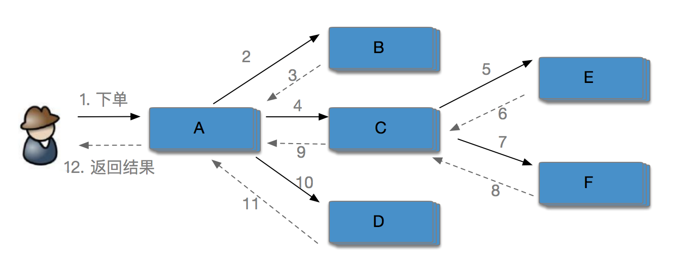

- # SOFARPC 链路追踪剖析
- ## 一. 前言
- 微服务已经被广泛应用在工业界，微服务带来易于团队并行开发、独立部署、模块化管理等诸多优点。然而微服务将原单体拆分多个模块独立部署，各模块之间链接变得错综复杂，在大规模分布式系统中这种复杂链路给维护带来了诸多困难。 如果对整个微服务架构不能了然于胸，便很难理清各模块之间的调用关系。 例如修改一个服务接口，对哪些服务造成影响不能快速定位。
- SOFARPC 在5.4.0 以后提供了链路追踪技术，可以有效协助开发运营人员进行故障诊断、容量预估、性能瓶颈定位以及调用链路梳理。
- 如思维导图所示，本文将从以下几个方面介绍目前已经开源的 SOFARPC 的链路追踪技术：
- 
- ## 二. 什么是链路追踪技术
- 链路追踪技术主要是收集、存储、分析分布式系统中的调用事件数据，协助开发运营人员进行故障诊断、容量预估、性能瓶颈定位以及调用链路梳理。 链路追踪技术包含了数据埋点、收集、存储、分析等相关技术，是一套技术体系。 大部分的链路追踪框架都是参考 google链路追踪系统Dapper 的一篇设计论文（《Dapper, a Large-Scale Distributed Systems Tracing Infrastructure》 ），SOFARPC 的SOFATracer 的设计灵感也是来自这篇著名论文。
- 以大规模分布式电商系统为例，用户下单购买某款产品时后端需要调用各系统或子模块进行协作，共同完成一个用户请求。 如下图所示，用户的下单行为涉及到了A、B、C、D、E、F 6个系统的协同工作，这些系统都是以集群形式部署。整个链路中最长的链路调用是3层，如 A-> C -> E 或 A -> C -> F。
- 
- 模块的增多加大了系统出错的概率，一旦因某系统/模块出错导致整个请求调用出错，在缺乏链路追踪的条件下很难定位具体出错的模块，只能通过日志搜索定位。 在实际生产环境下比较关注一个请求中的各个模块的耗时情况、连续调用情况、出错的节点等信息。
- 为了解决上述问题，Dapper提供了一套解决方案。整个方案分为数据收集、存储和分析几个部分。分布式追踪技术会记录一个请求中各模块的调用信息；并通过一个处理集群把所有机器上的日志增量地收集到集群当中进行处理，将同一个请求的日志串联；最后可视化显示调用情况。
- 常用的数据收集方式为埋点，通过在公共组件如RPC等注入代码，收集服务调用的相关信息。目前大部分链路调用系统如Dapper、鹰眼、Spring Cloud Sleuth 都在用这种模式。同样SOFARPC 作为一个公共的通讯框架，在金融业务领域被广泛应用，因此适合作为埋点，这样无需业务端自行埋点，可做到对业务代码的无侵入性。
- Dapper 将一个调用过程构建成一棵调用树(称为Tracer)，Tracer树中的每个节点表示链路调用中的一个模块或系统。 通过一个全局唯一的 traceId 来标识一个请求调用链。 并定义了span，span表示一个系统的调用，一个span 包含以下阶段：
-
- * Start:  发起调用
  * cleint send(cs): 客户端发送请求
  * Server Recv(sr)：服务端收到请求
  * Server Send(ss): 服务端发送响应
  * Client Recv(cr) : 客户端收到服务端响应
  * End： 整个链路完成
-