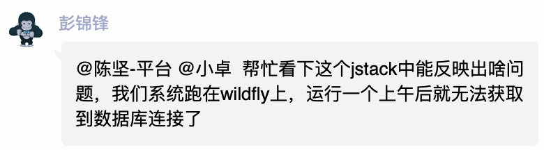
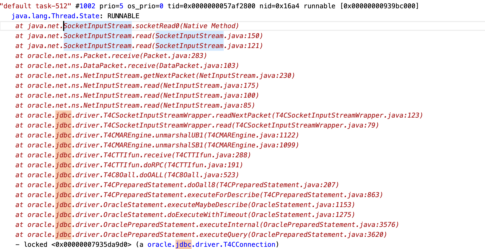

- ## 场景
- 
- 问题场景为服务在windfly运行时数据库是可用的。过一段时间之后就无法使用了。报错如下
- ```shell
  2022-05-17 14:42:12,426 ERROR [com.shine.fs.biz.DbTaskBiz] (Timer-5) Could not get JDBC Connection; nested exception is java.sql.SQLException: javax.resource.ResourceException: IJ000470: You are trying to use a connection factory that has been shut down: java:/ORACLEDS_CI_ODSDB: org.springframework.jdbc.CannotGetJdbcConnectionException: Could not get JDBC Connection; nested exception is java.sql.SQLException: javax.resource.ResourceException: IJ000470: You are trying to use a connection factory that has been shut down: java:/ORACLEDS_CI_ODSDB
  	at org.springframework.jdbc.datasource.DataSourceUtils.getConnection(DataSourceUtils.java:82)
  	at org.springframework.jdbc.core.JdbcTemplate.execute(JdbcTemplate.java:577)
  	at org.springframework.jdbc.core.JdbcTemplate.query(JdbcTemplate.java:641)
  	at org.springframework.jdbc.core.JdbcTemplate.query(JdbcTemplate.java:670)
  	at org.springframework.jdbc.core.JdbcTemplate.query(JdbcTemplate.java:678)
  	at org.springframework.jdbc.core.JdbcTemplate.query(JdbcTemplate.java:710)
  	at com.shine.ecimc.comm.spring.dao.BaseDao.query(BaseDao.java:65)
  	at com.shine.ecimc.comm.spring.dao.BaseDao.query(BaseDao.java:60)
  	at com.shine.fs.dao.JobDao.getUnFinishJobs(JobDao.java:36)
  	at com.shine.fs.dao.JobDao.getUnFinishJobs(JobDao.java:61)
  	at com.shine.fs.biz.DbTaskBiz$MonitorTask.run(DbTaskBiz.java:126)
  	at java.util.TimerThread.mainLoop(Timer.java:555)
  	at java.util.TimerThread.run(Timer.java:505)
  Caused by: java.sql.SQLException: javax.resource.ResourceException: IJ000470: You are trying to use a connection factory that has been shut down: java:/ORACLEDS_CI_ODSDB
  	at org.jboss.jca.adapters.jdbc.WrapperDataSource.getConnection(WrapperDataSource.java:146)
  	at org.jboss.as.connector.subsystems.datasources.WildFlyDataSource.getConnection(WildFlyDataSource.java:64)
  	at org.springframework.jdbc.datasource.DataSourceUtils.doGetConnection(DataSourceUtils.java:113)
  	at org.springframework.jdbc.datasource.DataSourceUtils.getConnection(DataSourceUtils.java:79)
  	... 12 more
  Caused by: javax.resource.ResourceException: IJ000470: You are trying to use a connection factory that has been shut down: java:/ORACLEDS_CI_ODSDB
  	at org.jboss.jca.core.connectionmanager.AbstractConnectionManager.allocateConnection(AbstractConnectionManager.java:777)
  	at org.jboss.jca.adapters.jdbc.WrapperDataSource.getConnection(WrapperDataSource.java:138)
  	... 15 more
  
  ```
- ## 可分析产物
- 1. jstack日志
  2. 显示日志
  3. 服务配置文件(standalone.xml)
- ## 问题分析
- ### jstack分析
- 通过分析jstack日志可知，在服务异常的情况下依然有少数jdbc连接处理runnable状态。
  
-
- 由上可知连接池是有效。而错误日志提示的是：
- > You are trying to use a connection factory that has been shut down
- ### 运行日志分析
- 运行日志中有效的信息即为上述的：You are trying to use a connection factory that has been shut down。
- 此场景通常出现在jdbc connection在数据库实例释放后仍然
-
-