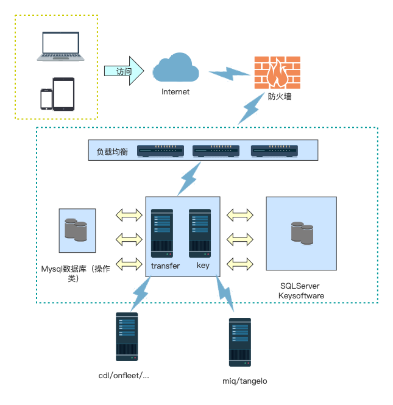

- ## 现有能力
- 定时任务
	- 定时修改订单的shipment status code ( interval 5min )
	- 定时发送event至upstream(interval 5min )
	- 定时发送exception event至upstream(interval 5min )
	- 定时从CDL获取VPOD(interval 2hour)
	- 定时从Onfleet获取VPOD(interval 2hour)
- 修改keysoftware的属性
	- vehiclepType
	- ref3
- 上游通过接口派发订单
	- tangelo(gobolt)--->未完成
- 监听下游webhook接口
	- onfleet
		- assign
		- started
		- completed
		- failed
- 维护功能
	- 任务停止
	- 任务重置
	- 任务查询(需要重构)
	- 批量重新推送event至上游
	- 任务查询
	- 任务日志查询
- 测试接口
	- 同步vpod
	- 上传vpod压缩包
- 
- ## 后续发展
- 后续该服务需要支持每日20000 Order的同步处理，需要高性能保证同步任务完备。
	- 目前同步任务耗时较大的为vpod类，单个请求需要2-3s，若单日有20000个vpod的请求，串行需要50000s进行处理，故需要单独新开线程池，并且以独立服务单独运行。
	- 其他同步任务暂无瓶颈，可合并为一个微服务单独运行。
	- 查询和维护界面需要单独抽离一个微服务运行。此时的部署架构如下：
-
-
-
-
-
-