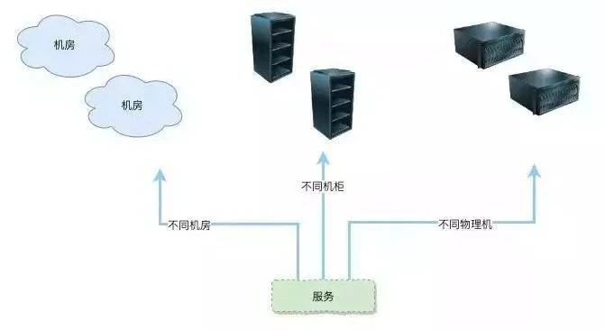
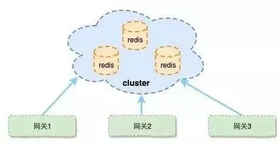
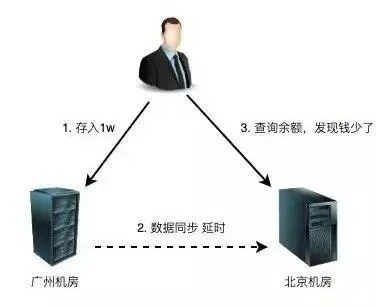
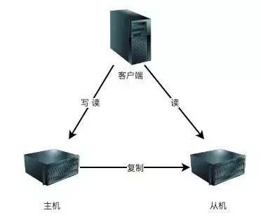
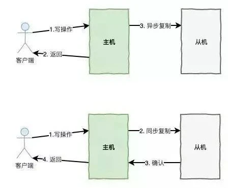
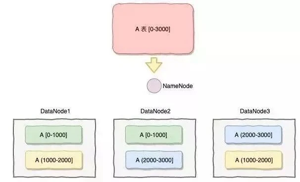

- ## 什么是高可用
- 在定义什么是高可用之前，我们可以先定义下什么是不可用：一个网站的内容最终呈现在用户面前需要经过若干个环节，而其中只要任何一个环节出现了故障，都可能导致网站页面不可访问，这个也就是网站不可用的情况。
- 参考维基百科，看看维基怎么定义高可用：
- > 系统无中断地执行其功能的能力，代表系统的可用性程度，是进行系统设计时的准则之一。
- 这个难点或是重点在于“无中断”，要做到 7x24 小时无中断无异常的服务提供。
- ## 为什么需要高可用
- 一套对外提供服务的系统是需要硬件、软件相结合，但是我们的硬件总是会出故障，软件会有 Bug，硬件会慢慢老化，网络总是不稳定，软件会越来越复杂和庞大。
- 除了硬件软件在本质上无法做到“无中断”，外部环境也可能导致服务的中断，例如断电，地震，火灾，光纤被挖掘机挖断，这些影响的程度可能更大。
- ## 高可用的评价纬度
- 在业界有一套比较出名的评定网站可用性的指标，常用 N 个 9 来量化可用性，可以直接映射到网站正常运行时间的百分比上：
- 
- 例如，有一些服务的升级或数据迁移明明可以在深夜停机或停服务进行，然而考虑到以后的报告要显示出我们的系统达到了多少个 9 的高可用，而放弃停服务这种简单的解决方案，例如停机 2 个小时，就永远也达不到 4 个 9。
- 然而在一些高并发的场合，例如在秒杀或拼团，虽然服务停止了几分钟，但是这个对整个公司业务的影响可能是非常重大的，分分钟丢失的订单可能是一个庞大的数量。
- 所以 N 个 9 来量化可用性其实也得考虑业务的情况。
- ## 微服务高可用设计手段
- 高可用是一个比较复杂的命题，基本上在所有的处理中都会涉及到高可用，所有在设计高可用方案也涉及到了方方面面，如服务冗余、负载均衡、服务限流等。
- 这中间将会出现的细节是多种多样的，所以我们需要对这样一个微服务高可用方案进行一个顶层的设计，围绕服务高可用，先检查下我们手里有多少张牌。
- ### 服务冗余
- ##### 1、冗余策略
- 每一个访问可能都会有多个服务组合而成，每个机器每个服务都可能出现问题，所以第一个考虑到的就是每个服务必须不止一份可以是多份。
- 所谓多份一致的服务就是服务的冗余，这里说的服务泛指了机器的服务，容器的服务，还有微服务本身的服务。
- 在机器服务层面需要考虑，各个机器间的冗余是否有在物理空间进行隔离冗余。
- 例如是否所有机器分别部署在不同机房，如果在同一个机房是否做到了部署在不同的机柜，如果是 Docker 容器是否部署在分别不同的物理机上面。
- 采取的策略其实也还是根据服务的业务而定，所以需要对服务进行分级评分，从而采取不同的策略。
- 不同的策略安全程度不同，伴随着的成本也是不同，安全等级更高的服务可能还不止考虑不同机房，还需要把各个机房所处的区域考虑进行。
- 例如，两个机房不要处在同一个地震带上等等。
- 
- ##### 2、无状态化
- 服务的冗余会要求我们可以随时对服务进行扩容或者缩容，有可能我们会从 2 台机器变成 3 台机器。
- 想要对服务进行随时随地的扩缩容，就要求我们的服务是一个无状态化，所谓无状态化就是每个服务的服务内容和数据都是一致的。
- 例如，从我们的微服务架构来看，我们总共分水平划分了好几个层，正因为我们每个层都做到了无状态，所以在这个水平架构的扩张是非常的简单。
- 假设，我们需要对网关进行扩容，我们只需要增加服务就可以，而不需要去考虑网关是否存储了一个额外的数据。
- 
- 网关不保存任何的 Session 数据，不提供会造成一致性的服务，将不一致的数据进行几种存储，借助更加擅长数据同步的中间件来完成。
- 这个是目前主流的方案，服务本身尽可能提供逻辑的服务，将数据的一致性保证集中式处理，这样就可以把“状态”抽取出来，让网关保持一个“无状态”。
- 这里仅仅是举了网关的例子，在微服务基本所有的服务，都应该按照这种思路去做。
- 如果服务中有状态，就应该把状态抽取出来，让更加擅长处理数据的组件来处理，而不是在微服务中去兼容有数据的状态。
- #### 数据存储高可用
- 之前上面说的服务冗余，可以简单的理解为计算的高可用，计算高可用只需要做到无状态既可简单的扩容缩容，但是对于需要存储数据的系统来说，数据本身就是有状态。
- 跟存储与计算相比，有一个本质的差别：将数据从一台机器搬到另一台机器，需要经过线路进行传输。
- 网络是不稳定的，特别是跨机房的网络，Ping 的延时可能是几十几百毫秒，虽然毫秒对于人来说几乎没有什么感觉，但是对于高可用系统来说，就是本质上的不同，这意味着整个系统在某个时间点上，数据肯定是不一致的。
- 按照“数据+逻辑=业务”的公式来看，数据不一致，逻辑一致，最后的业务表现也会不一致。
- 举个例子：
- 
- 无论是正常情况下的传输延时，还是异常情况下的传输中断，都会导致系统的数据在某个时间点出现不一致。
- 而数据的不一致又会导致业务出现问题，但是如果数据不做冗余，系统的高可用无法保证。
- 所以，存储高可用的难点不在于怎么备份数据，而在于如何减少或者规避数据不一致对业务造成的影响。
- 分布式领域中有一个著名的 CAP 定理，从理论上论证了存储高可用的复杂度，也就是说，存储高可用不可能同时满足“一致性，可用性，分区容错性”。
- 最多只能满足 2 个，其中分区容错在分布式中是必须的，就意味着，我们在做架构设计时必须结合业务对一致性和可用性进行取舍。
- 存储高可用方案的本质是将数据复制到多个存储设备中，通过数据冗余的方式来实现高可用，其复杂度主要呈现在数据复制的延迟或中断导致数据的不一致性。
- 我们在设计存储架构时必须考虑到以下几个方面：
- 1. 数据怎么进行复制
  2. 架构中每个节点的职责是什么
  3. 数据复制出现延迟怎么处理
  4. 当架构中节点出现错误怎么保证高可用
- ##### 1、数据主从复制
- 主从复制是最常见的也是最简单的存储高可用方案，例如 MySQL，Redis 等等。
- 
- 其架构的优点就是简单，主机复制写和读，而从机只负责读操作，在读并发高时候可用扩张从库的数量减低压力，主机出现故障，读操作也可以保证读业务的顺利进行。
- 缺点就是客户端必须感知主从关系的存在，将不同的操作发送给不同的机器进行处理。
- 而且主从复制中，从机器负责读操作，可能因为主从复制时延大，出现数据不一致性的问题。
- ##### 2、数据主从切换
- 刚说了主从切换存在两个问题：
- 主机故障写操作无法进行。
- 需要人工将其中一台从机器升级为主机。
- 为了解决这个两个问题，我们可以设计一套主从自动切换的方案，其中涉及到对主机的状态检测，切换的决策，数据丢失和冲突的问题。
- **主机状态检测**： 需要多个检查点来检测主机的机器是否正常，进程是否存在，是否出现超时，是否写操作不可执行，是否读操作不可执行，将其进行汇总，交给切换决策。
- **切换决策**： 确定切换的时间决策，什么情况下从机就应该升级为主机，是进程不存在，是写操作不可行，连续检测多少失败次就进行切换。
- 应该选择哪一个从节点升级为主节点，一般来说或应该选同步步骤最大的从节点来进行升级。切换是自动切换还是半自动切换，通过报警方式，让人工做一次确认。
- **数据丢失和数据冲突**： 数据写到主机，还没有复制到从机，主机就挂了，这个时候怎么处理，这个也得考虑业务的方式，是要确保 CP 或 AP。
- 
- 还要考虑一个数据冲突的问题，这个问题在 MySQL 中大部分是由自增主键引起。
- 就算不考虑自增主键会引起数据冲突的问题，其实自增主键还要引起很多的问题，这里不细说，避免使用自增主键。
- ##### 3、数据分片
- 上述的数据冗余可以通过数据的复制来进行解决，但是数据的扩张需要通过数据的分片来进行解决（如果在关系型数据库是分表）。
- 
- 何为数据分片（Segment、Fragment、Shard、 Partition），就是按照一定的规则，将数据集划分成相互独立、正交的数据子集，然后将数据子集分布到不同的节点上。
- HDFS ， MongoDB 的 Sharding 模式也基本是基于这种分片的模式去实现。
- 我们在设计分片主要考虑到的点是：
- 1. 做数据分片，如何将数据映射到节点。
  2. 数据分片的特征值，即按照数据中的哪一个属性（字段）来分片。
  3. 数据分片的元数据的管理，如何保证元数据服务器的高性能、高可用，如果是一组服务器，如何保证强一致性。